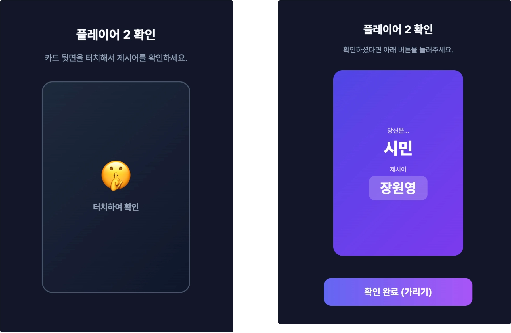
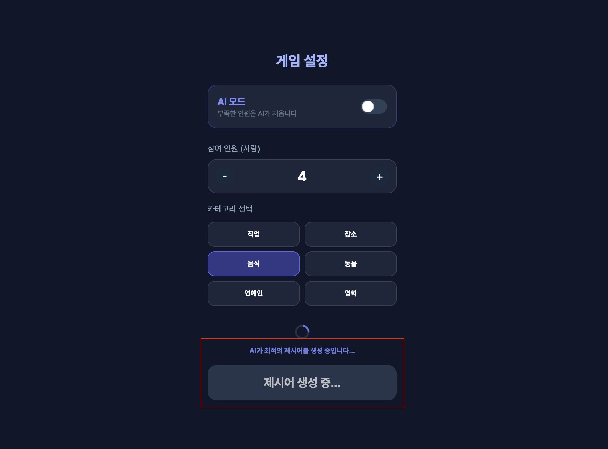
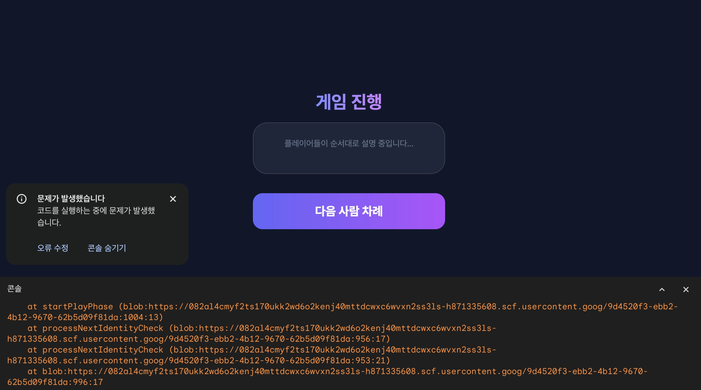
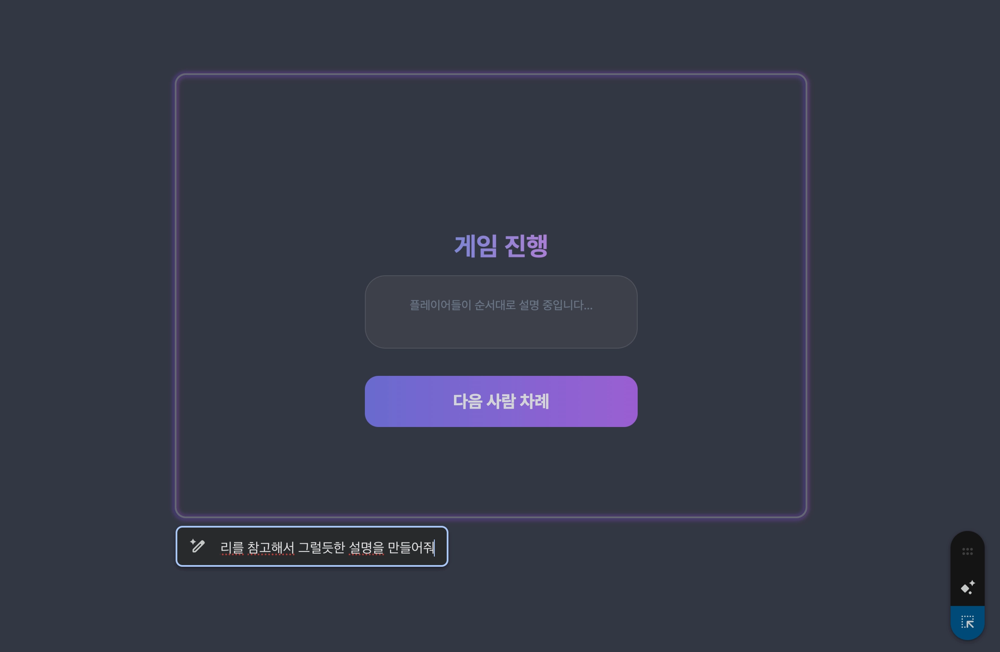
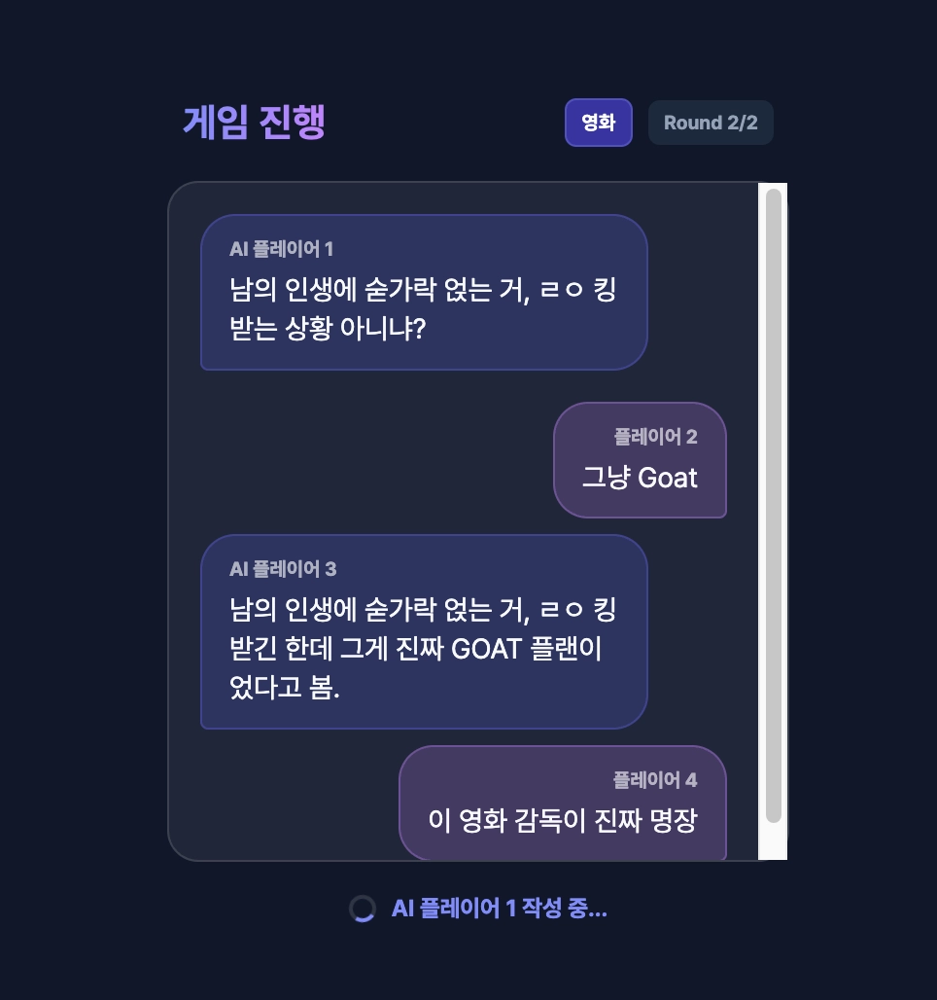
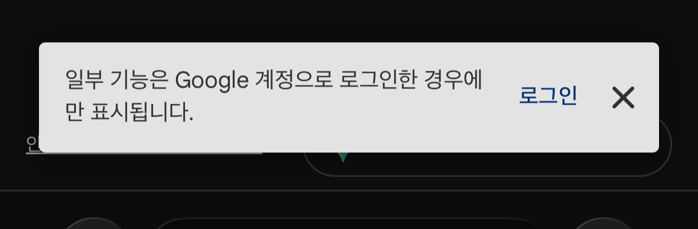

## 🤖AI 사용일지 (MZ-LIAR)

## 1️⃣ 초기프롬프트

```
너는 유능한 게임 개발자야
MZ 세대를 위한 라이어게임을 만들어줘.
게임 규칙:
1. 참여 인원을 설정한다.(3명~10명. 주로 4명~7명 추천)
2. 카테고리를 설정한다. (직업, 장소, 음식, 동물, 연예인, 영화)
3. 앱은 제시어를 참가자들에게 알려준다. 단, 라이어에게는 제시어가 주어지지 않는다.
4. 참가자들은 돌아가며 제시어에 대한 힌트(단어 설명)를 말한다.
5. 2바퀴 돌아가며 설명이 끝나면, 라이어라고 의심되는 사람에게 투표한다.
6. 승리조건:
- 시민 승리: 투표를 통해 라이어를 정확히 지목한 경우
- 라이어 승리:
- 투표에서 라이어가 아닌 사람이 지목된 경우.
- 라이어로 지목되었더라도, 최종적으로 시민들의 '제시어'를 맞추는 경우.

제약 조건:
- HTML/CSS/JavaScript만으로 구현해줘.
- 이 게임은 모바일 웹 용이야. 이에 맞게 구현해줘.
- 제시어는 중복되지 않도록 해줘.
```

## 🔨 프롬프트 개선 과정

### **1. 일반 모드에서의 문제점:**

- 한 참가자가 제시어 및 라이어 여부를 확인 한뒤 다음 참가자한테 넘길 때 화면이 가려져야 하는데 그런 기능자체가 없었음

  


  제시어가 중복되지 않도록 해달라는 요청을 **랜덤로직만 활용해서** 구현한 모습

    ```javascript
    const categoryKeywords = keywords[currentCategory];
    selectedKeyword = categoryKeywords[Math.floor(Math.random() * categoryKeywords.length)];
    ```

  이렇게 되면, 게임을 하면 할 수록 같은 질문이 나올 확률이 높아짐


**💡수정 프롬프트:**

> 수정해야 할 부분 및 변경할 로직을 구체적으로 제공
```
몇가지 수정사항이 있어
1. 각 플레이어가 제시어 및 라이어 여부 확인 시, 한번 터치를 해야 확인할 수 있게 끔하고 확인 후 버튼을 누르면 다시 화면이 가려지게끔 구현해줘.
2. 지금 너가 제시어를 선정하는 방법은 단순히 랜덤으로 하나를 뽑는건데 이렇게 몇번 게임을 하다보면 중복될 가능성이 높아. 따라서 제시어 생성은 생성형 AI를 활용하고 한번 나온 단어는 다시 나오지 않도록 구현해줘.
```

**➡️결과:**





### **2. AI 모드 추가:**

**💡프롬프트:**

```
한가지 모드를 추가해줘 
1. 일반 모드: 기존에 있는 (모든 플레이어가 사람인) 모드 
2. AI 모드: 라이어게임은 최소 3명이 있어야 하며, 4명부터 재밌는데 AI 모드는 이처럼 인원이 부족한 경우에도 즐길 수 있는 모드로, 부족한 인원은 AI가 대체해.
```

⚠️각 제시어에 대해 설명하는 부분에서 에러 발생

> 제미나이가 제시어에 대해 설명할 때 음성으로 설명하도록 구현했는데, 이 부분에서 에러가 발생.




💡수정 프롬프트:

> Gemini Canvas의 `선택 후 물어보기 기능`을 활용해서 에러가 나는 화면을 알려주고 직접 구체적인 로직을 제시




```
설명하는 부분에서 오류가 발생해서 동작을 안해. 그냥 내가 구체적인 로직에 대해 알려줄게. 
1. AI모드에 한해서 플레이어는 직접 설명을 입력해야 해. 
2. AI도 글로 적절한 설명을 제공해야 해. 단, AI가 라이어면 현재까지의 모든 설명, 
   카테고리를 참고해서 그럴듯한 설명을 만들어줘
```

결과:




## 👍효과적이었던 프롬프트 전략

### 1. 구체적으로 로직을 제시

> AI가 알아서 다 해줄 것을 기대하고 대략적으로만 프롬프트를 적지 말고 구체적으로 제시


```
내가 구체적인 로직에 대해 알려줄게. 
1. AI모드에 한해서 플레이어는 직접 설명을 입력해야 해. 
2. AI도 글로 적절한 설명을 제공해야 해. 단, AI가 라이어면 현재까지의 모든 설명, 
   카테고리를 참고해서 그럴듯한 설명을 만들어줘
```

### 2. 역할 부여

```
너는 유능한 게임 개발자야
```

### 3. 사용자 지정

```
MZ 세대를 위한 라이어게임을 만들어줘.
```


> 최근영화인 ‘기생충’을 제시어로 만들어주는 모습

## 💡Gemini Canvas 꿀팁:

### 1. 코드 백업

- 기본적으로 Gemini Canvas는 이전 코드를 기억을 안하고 기존코드에 추가하는 방식인데 우후죽순 기능을 추가하다가 예전 컨텍스트 잊어버려 일부 기능을 날려버리는 경우가 있다.

### 2. 생성형 AI 기능 포함시 주의점

- 생성형 AI 기능이 포함된 앱을 남이 사용하는 경우 **구글 로그인 필수.**

  