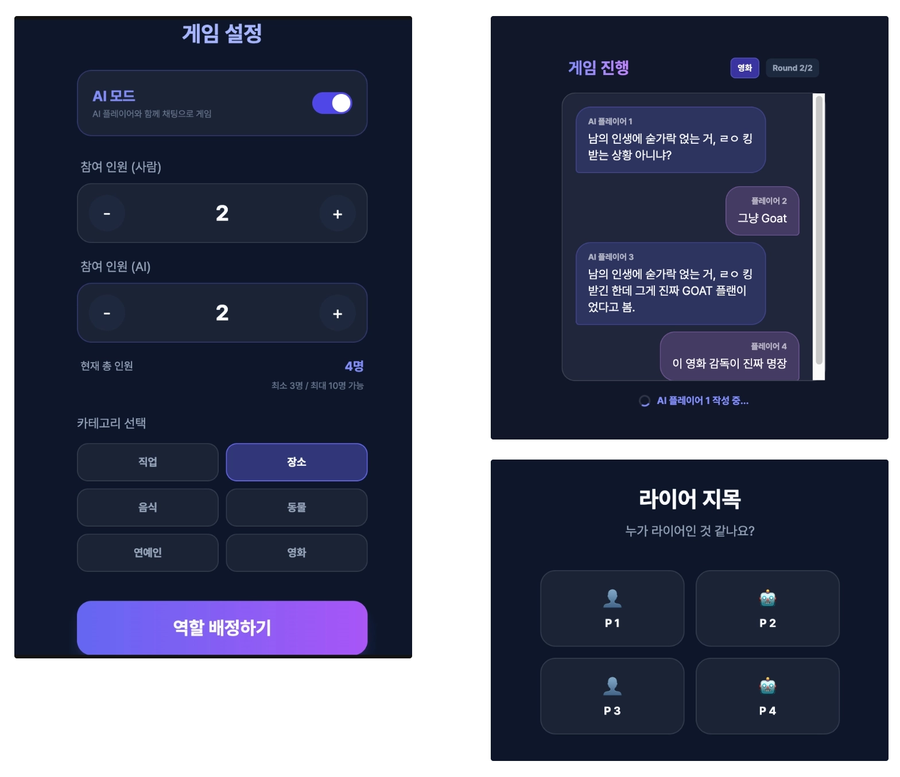

## 앱 이름: MZ LIAR

## 카테고리: 게임

### 배포 링크
https://gemini.google.com/share/ecc84edcf03d

### 이 앱을 만든 이유

- 기존 라이어게임은 최소 3명의 인원이 있어야 하며 4명부터 게임이 재밌어지는데 인원이 부족한 경우에도 게임을 즐길 수 있고자 했다.

### 주요 기능 
> (AI 기능의 경우 🤖가 붙어있습니다.)

- **일반 모드**: 게임을 즐길 수 있는 인원이 충분히 갖춰졌을 때 하는 모드

  

- **🤖AI 모드**: 게임을 즐길만한 인원이 충분히 갖춰지지 않았을 때도 즐길 수 있는 모드. 원하는 만큼 AI를 추가할 수 있다.

  

- **🤖중복되지 않는 제시어 생성 기능**: 사전에 제시어를 한정해둔다면, 여러 번 게임을 진행했을 때 중복되는 문제가 발생하는데, 생성형 AI를 사용해 중복되지 않는 제시어를 생성.

  