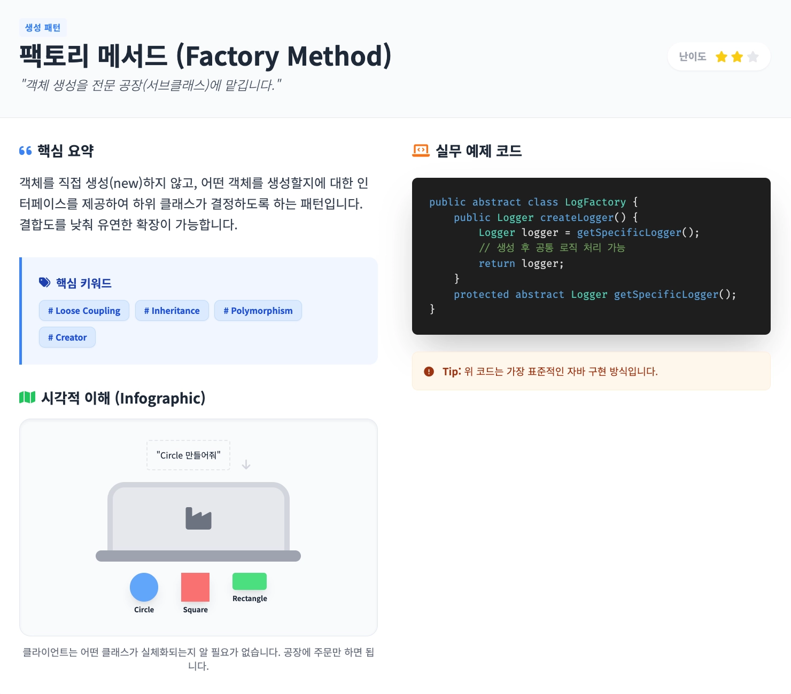

## 앱 이름: **Java Design Patterns for Junior**

## 카테고리: 학습 앱

### 배포 링크

https://gemini.google.com/share/1e19816d0463

### 이 앱을 만든 이유

- 다양하고 복잡한 GoF 디자인 패턴을 설명, 시각자료(인포그래픽), 예시 코드를 통해 쉽게 공부할 수 있다.

### 주요 기능 🤖
> (AI 기능의 경우 🤖가 붙어있습니다.)
- 주요 핵심 5가지 GoF 디자인 패턴을 선별해 해당 패턴들에 대한 설명, 시각자료(인포그래픽), 예시 코드를 제공한다.

  

- 🤖AI가 5가지 패턴에 대한 객관식 퀴즈를 생성한다. 사용자는 문제 수, 난이도를 설정할 수 있다.

  