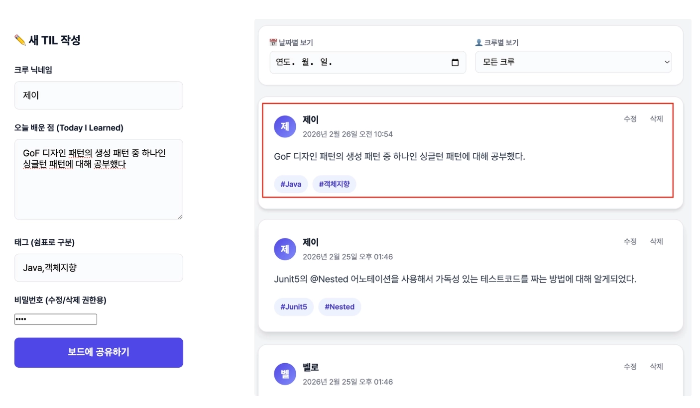
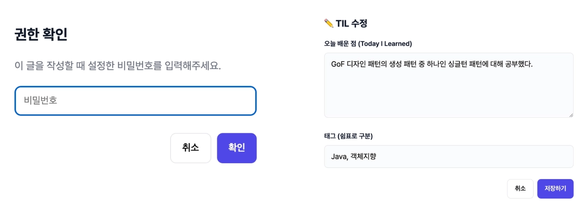
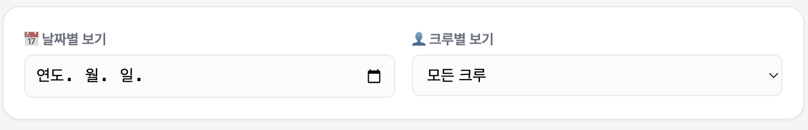

## 앱 이름: 데일리 스크럼 TIL

## 카테고리: 페어 프롬프트 릴레이

### 배포 링크

https://gemini.google.com/share/2117e4c0e5f0

### 이 앱을 만든 이유

- 어떤 문제/불편함을 해결하려고 했나요?
    - 데일리를 진행할 때, 서로 공부한 것을 공유하고 싶은데 제대로 된 플랫폼이 없어 불편
- 이 앱을 언제, 어떻게 사용할 건가요?
    - 데일리 시간에 서로 공부한걸 이야기 할 때
    - 이전에 어떤 공부를 했는지 확인하고 싶을 때

### 주요 기능

- **데일리 TIL 작성 기능**: 크루명, 공부 내용, 태그 작성 가능

  

- **TIL 수정/삭제 기능**: TIL 최초 작성시 비밀번호를 지정해, 해당 비밀번호를 입력해야지만 수정/삭제가 가능

    

- **TIL 필터링 기능**: 특정 날짜, 특정 크루의 TIL만 필터링해서 확인 가능

  

- **데이터베이스 연동**: FireBase를 연동하여 데이터를 영속화