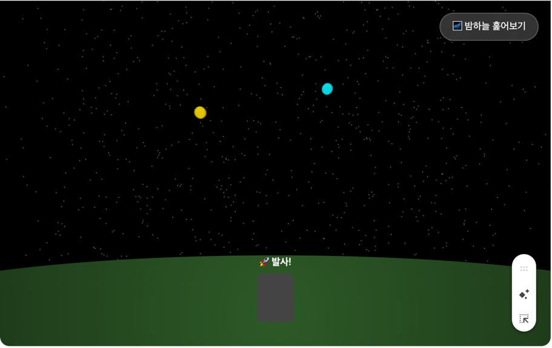
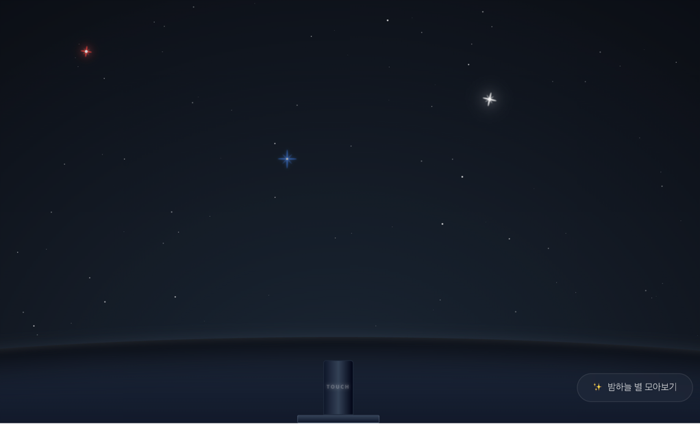
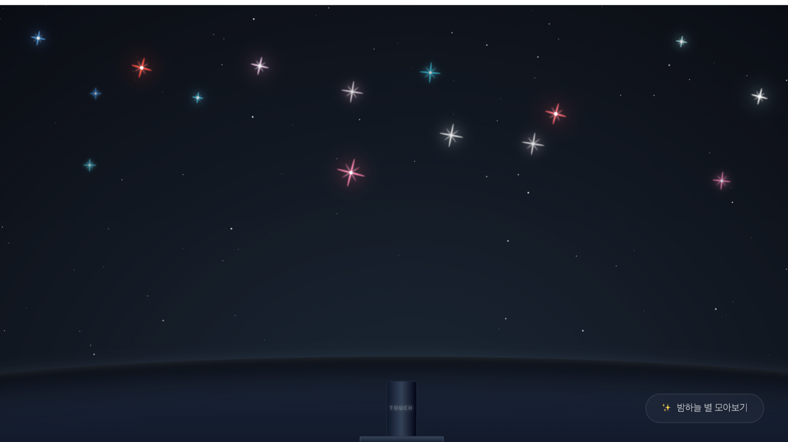

# gemini-canvas-mission

Gemini Canvas 미션 결과물을 관리하는 저장소입니다.

## 목적

- Gemini Canvas로 제작한 웹앱 결과물을 기록하고 공유합니다.
- 앱별 요구사항, 배포 링크, 회고를 일관된 형식으로 남깁니다.


## 📝 AI 사용 일지
- 본인 기준으로 가장 잘 만들어진 앱 1개를 골라주세요.
- 아래 불릿 포인트는 예시입니다. 각 항목의 취지를 참고해 본인의 실제 경험을 중심으로 자유롭게 작성해 주세요.

### 대상 앱 이름

우아한 갤럭시

### 1. 초기 프롬프트

```text
필수(핵심 공통): 대괄호([])로 표현된 핵심 키워드를 바탕으로 관련 프롬프트를 작성해나간다.
아래 프롬프트를 확인하고 요구사항을 만족하는 프로그램을 만들어야 한다.

[페르소나]
우테코에 합격한 개발자 이프!
개발자 이프는 우테코 활동을 진행하는 하루하루에 대한 일기를 작성하고 싶어해. 그리고 이 일기를 우테코 크루들과 함께 공유하며 같이 성장하고 싶어하는 개발자야.

[배경]
그런데 문득 이런 생각이 들었다?
"단순히 일기를 작성하는 것이라면, 이미 기존에 잘 만들어진 일기장이 많은데 왜 만들어야 할까?"
그래서 개발자 이프는 조금 더 '우테코'의 색깔을 담고 싶어해.

마침 이프가 참여하는 우테코 8기의 최종 코테 과제가 **행성** 로또였어.
그래서 "행성 로또 처럼 일기들을 하나의 행성으로, 별로 표현하면 어떨까?"라는 생각을 했어. 그리고 관련 일기 프로그램을 만들려고 3D, 시각화, 프로토 타입에 탁월한 Gemini Canvas를 찾아왔어.

[요구사항]
1. 일기 작성 기능
  * 글, 오늘 날짜 및 시간
  * 글 작성 버튼
2. 일기 수정 기능
  * 작성과 동일하나 텍스트만 수정으로 변경
3. HTML, CSS, Vanila Js만 활용한다.
4. 다만 이후 정보 영속화를 위해 NoSQL 기반인 Firebase를 사용할 예정이다. 그래서 임의의 목 데이터 정보를 생성해 js에서 초기 정보를 생성한다.
5. UI 1 - 하단에는 호 모양으로 초원으로, 그 상단에는 밤하늘을 만들어줘.
6. UI 2 - 화면 아래에 발사할 수 있는 대포 같은 것을 만들어서, 클릭하면 일기장을 작성할 수 있도록 해줘.
7. UI 3 - 일기장을 작성하면 대포에서 발사해 밤하늘의 별이 된다. 위치는 랜덤이다.
8. UI 4 - 밤하늘의 별을 클릭하면 일기를 볼 수 있다.
9. UI 5 - 밤하늘 훑어보기 버튼을 통해 전체 일기를 볼 수 있다. 날짜 정렬이 된다.
10. 모바일 UI에도 적용할 수 있도록 반응형을 고려한다.
```

### 2. 프롬프트 개선 과정

- 처음 결과물의 문제점은 무엇이었나요?
    
```text
첨부된 이미지와 같이 별이 단색이고, 대포 모양도 너무 초라함
그리고 대포가 발사 될 때 별이 날라가는듯한 애니메이션이 없어서 허전했고,
발사 글자 위치도 마음에 안들었따.

대부분 UI적인 문제였다.
```
- 어떤 식으로 프롬프트를 수정했나요?
```text
> 추가 프롬프트
[추가 요구사항]
별을 네온 빛의 청색 혹은 청백색(젊은 별), 혹은 적색(오래된 별)으로 반짝 거리는 애니메이션 효과를 표현해줘. 정확한 색깔은 별마다 달라서, 실제 별과 유사한 색깔로 처리해주면 좋겠어.
색깔은 일기 작성 일자들을 기준으로 비율을 둬서 일기장이 생성될 때마다 색깔들이 변경되도록 하고 싶어.
그리고 초원도 약간의 질감이 표현되면 좋겠어.
삽입된 "번호 뽑기 대포 게임"처럼 가운데 대포 디자인도 조금 더 디테일 해져야 되고, 대포 위의 발사 버튼은 제거 해줘.
그리고 대포에서 발사되는 별들이 UI적으로 보여야 돼. 발사되는 과정이 보이고 밤 하늘에 등록되어야 하는거야!

이런식으로 프롬프트를 작성했다가 완전 이상한 결과물이 생성되었다. (사진 생략)

그래서 개선하기 위해 엄청나게 다양한 방식으로 프롬프트를 작성해나갔다.
```
- 몇 번의 반복을 거쳤나요?
```text
30번은 넘게 한 것 같다.

특정 결과물 하나가 나오면 shared 기능을 통해,
여러 세션에서 여러가지 프롬프팅으로 계속해서 수정하는 과정들을 거쳤고
작업이 마무리 된 시점에서 필요없는 대화 내용들은 지우는 식으로 했습니다.

그래서 정확히 몇 회의 반복을 거쳤는지는 알 수 없었습니다.
```

### 3. 효과적이었던 프롬프팅 전략

- 어떤 방식으로 요청했을 때 원하는 결과가 나왔나요?
```text
하나씩 디테일하게 수정하는게 가장 효과적이었습니다. 
```
- 반대로 효과가 없었던 방식은 어떤게 있었나요?
```text
수정하는 과정에서 한 번에 광범위하니 AI가 알아듣지를 못했습니다.
```

### 4. 배운 점

- Gemini Canvas를 효과적으로 사용하기 위한 나만의 팁이 있다면?
```text
단순히 프롬프팅만으로는 한계가 있다고 느꼈습니다.
Gemini Canvas를 효과적으로 사용하기 위해 기본적인 틀이 있다고 생각합니다.

1. 초안은 무조건 긴 프롬프트를 사용해 원하는 결과물에 필요한 요소들을 최대한 포함한다.
2. 수정 작업에서는 하나 내지 두개 정도로 작은 단위로 수정을 한다.

이 정도가 기본 틀이라고 생각되고, 저만의 디테일은 아래와 같습니다.

Canvas를 활용한 프로그램 제작에는 명확한 명령이 필요하다.
-> 내 생각이 먼저 명확한지 정리할 필요가 있다.
-> 내 생각을 AI를 통해 명확하게 정리하는 과정을 거친다.

예를 들어 어떤 디자인을 표현하고 싶은데, 디자인 경험이 부족하다면
"A처럼 하고 싶은데 디자이너의 입장에서 A를 설명할 수 있는 명확한 표현을 알려줘."
와 같은 프롬프팅으로 Gemini Ai 등을 이용해 제 생각을 먼저 정리했습니다.

그리고 정리된 내용으로 Canvas에서 작업을 이어갔습니다. 
```

### 5. 리뷰어에게 피드백 받고 싶은 포인트

1. 제가 생각한 방법에서 조금 더 디테일하게 생각할 수 있는 방법이 있을까요?
2. 제 생각을 어떻게 하면 온전하게 표현할 수 있을까요?
   * 스스로 깨닫기 위해 여러가지 방법을 써봤지만, 디자인적으로 정말 힘든 부분이 있었습니다.
     
     
   * 저는 별의 색을 크게 파란색 -> 흰색 -> 적색으로 표현하고 싶었어요.
   * 근데 너무 명확한 단색과 같아서 네온을 추가하고, 방향을 돌린 십자가들을 겹쳐서 조금 더 제가 원하는 색깔을 표현했습니다.
   * 하지만 아직까지 만족스럽지 않은데... 어떻게 개선할 수 있을까요?
   * 별의 색이 파란색, 흰색, 적색 계열에서 벗어나지 않고 싶은게 가장 큰 것 같아요.
   * 유사한 이미지도 못찾겠고... AI를 활용해도 제가 생각하는 표현을 명확히 나타내기 힘들었습니다.