# gemini-canvas-mission

Gemini Canvas 미션 결과물을 관리하는 저장소입니다.

## 목적

- Gemini Canvas로 제작한 웹앱 결과물을 기록하고 공유합니다.
- 앱별 요구사항, 배포 링크, 회고를 일관된 형식으로 남깁니다.

## 유틸리티: 오늘의 친구
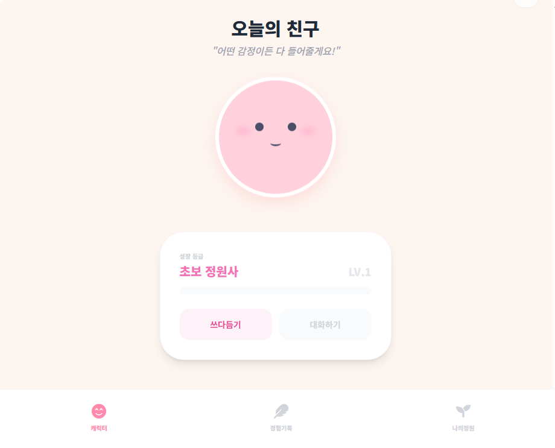
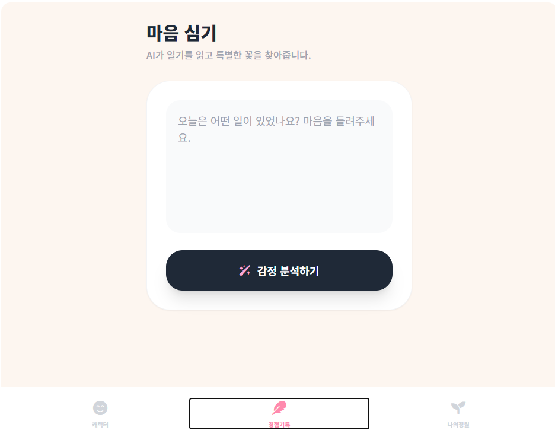
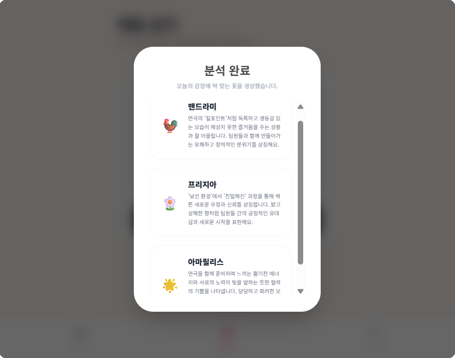
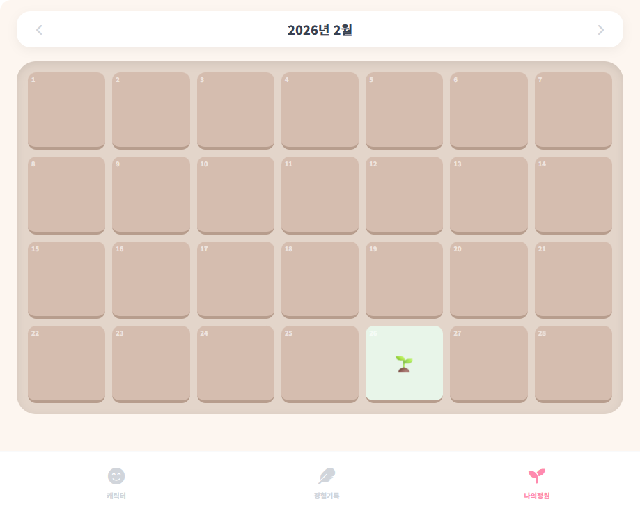
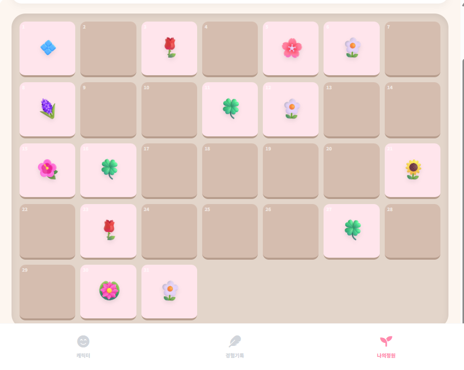
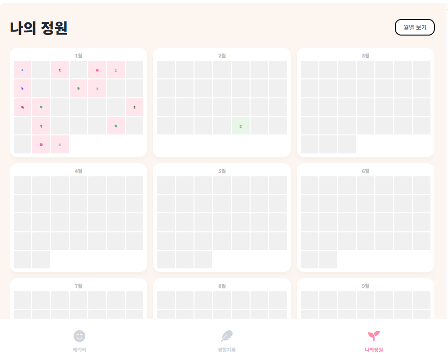
## 게임: 다함께 밸런스
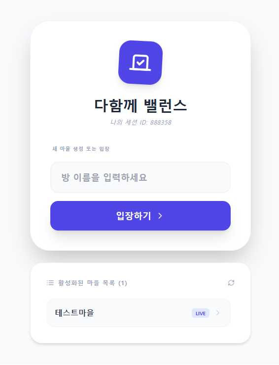
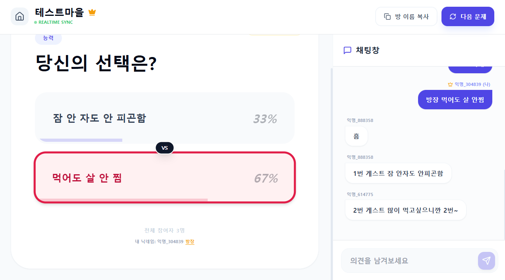
## 학습: 유연한 학습
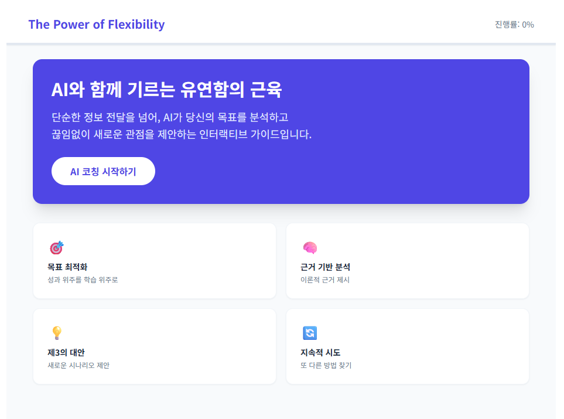
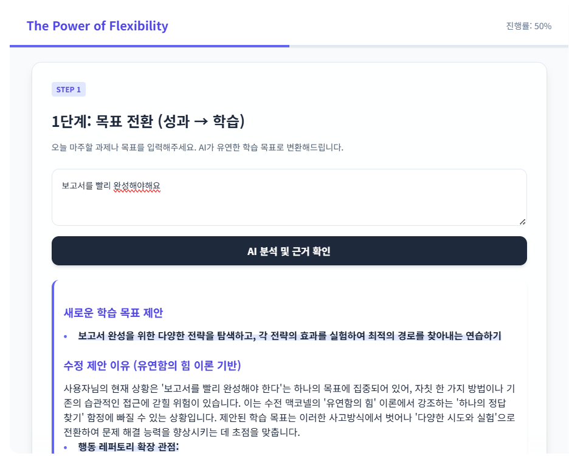
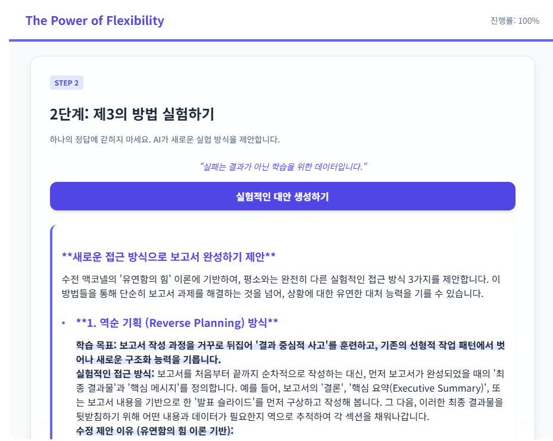
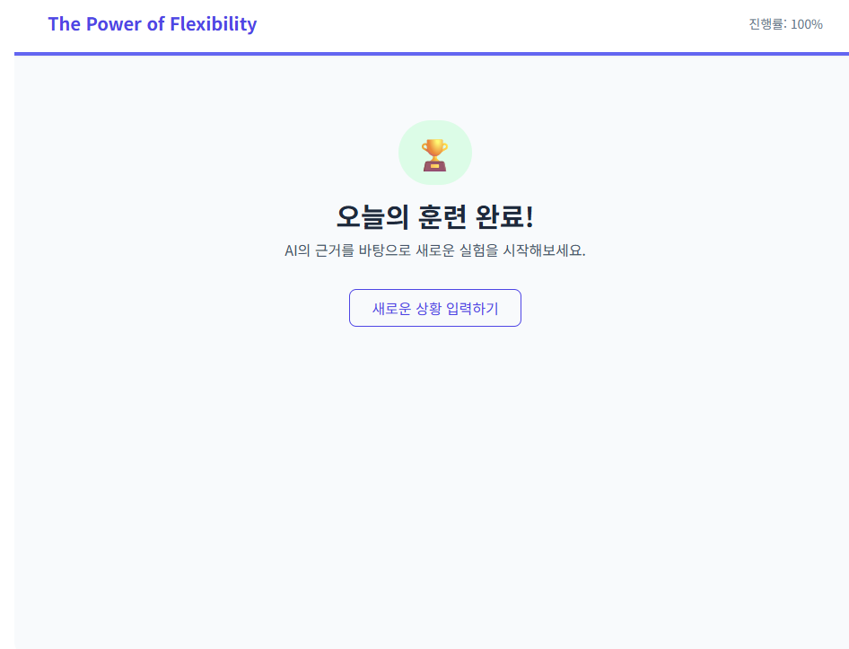
## 페어프로그래밍: 3D 대환장 레이싱
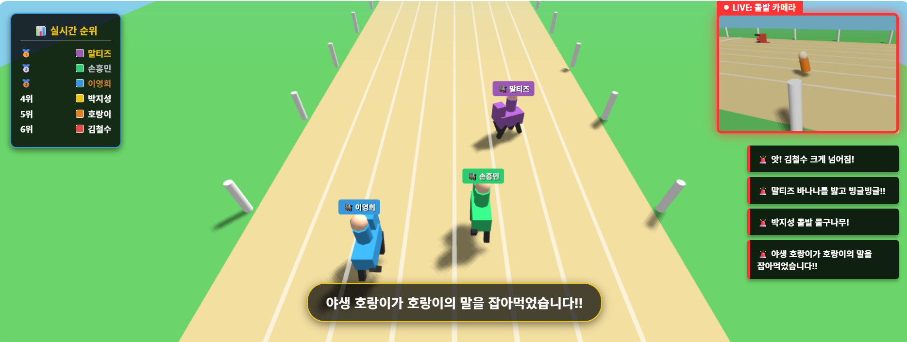