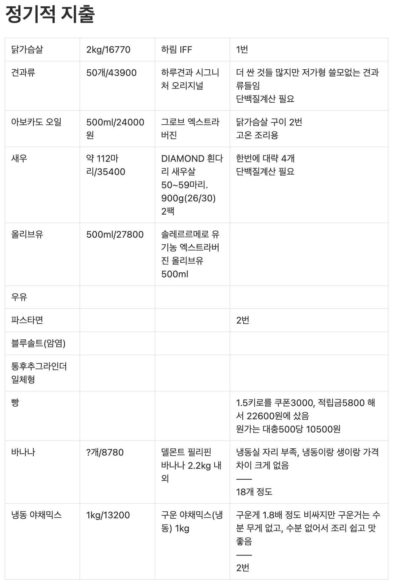
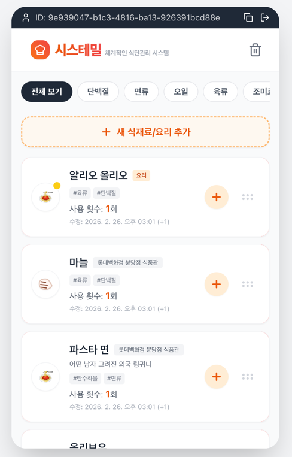
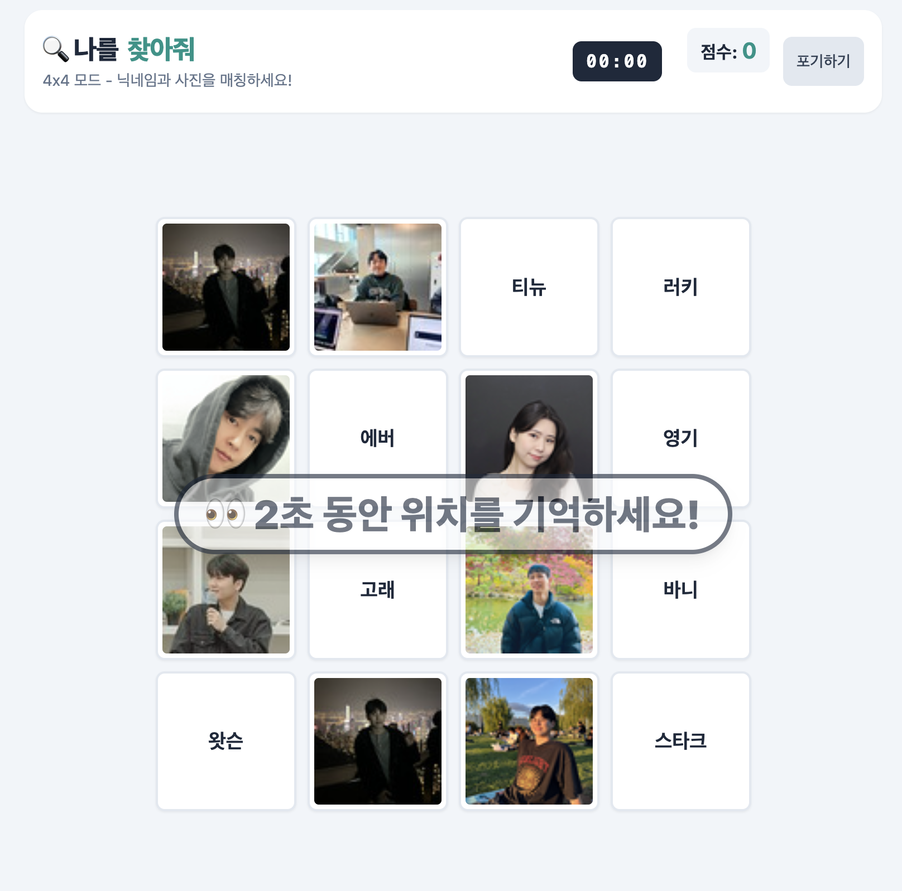
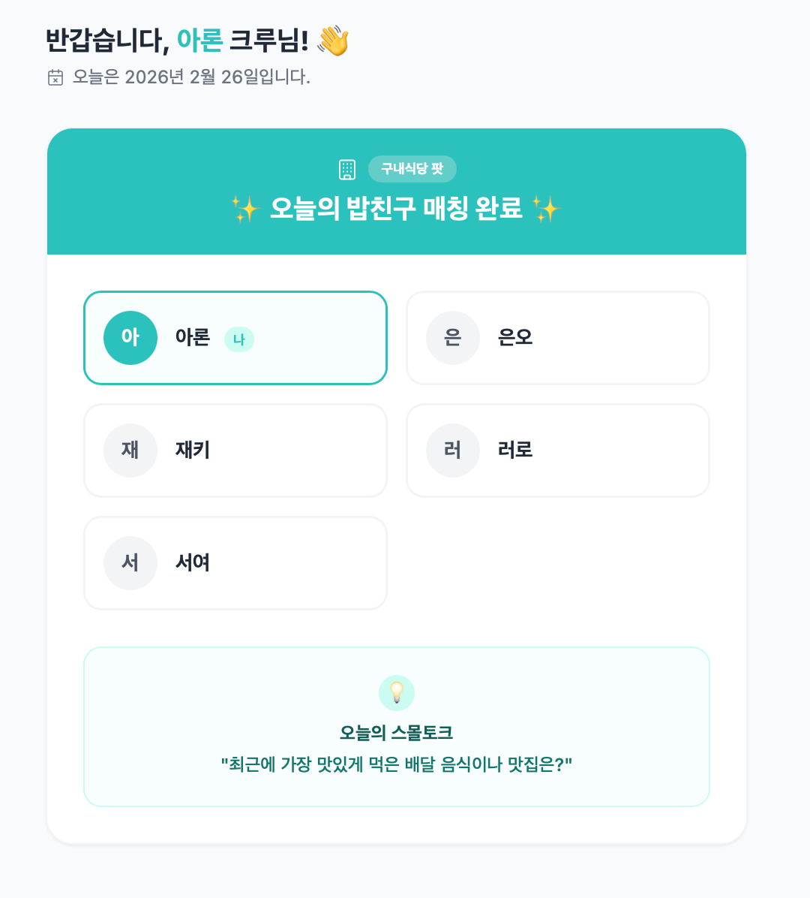
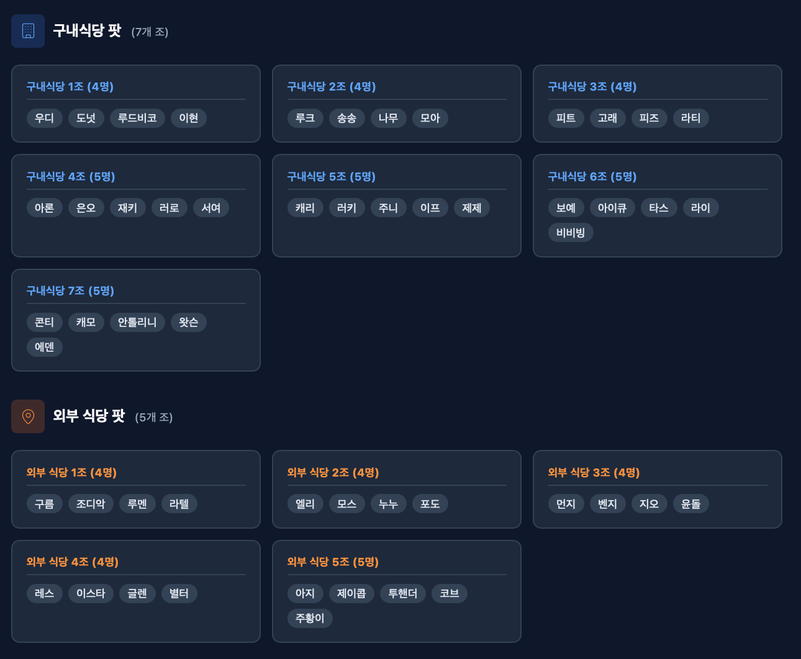

# gemini-canvas-mission

Gemini Canvas 미션 결과물을 관리하는 저장소입니다.

## 목적

- Gemini Canvas로 제작한 웹앱 결과물을 기록하고 공유합니다.
- 앱별 요구사항, 배포 링크, 회고를 일관된 형식으로 남깁니다.

---

## 목차
- [유틸리티 앱: 시스테밀](#앱-이름-시스테밀systemeal)
- [게임: 나를 찾아줘](#앱-이름-나를-찾아줘find-me)
- [페어 프롬프트 릴레이: 우테코 밥친구](#앱-이름-우테코-밥친구)

---

## 앱 이름: 시스테밀(Systemeal)

## 카테고리: 유틸리티 앱

### 배포 링크

https://gemini.google.com/share/5a4e9d266fcc

### 이 앱을 만든 이유

- **어떤 문제/불편함을 해결하려고 했나요?**
  ```text
  기존에는 아래 첨부한 사진과 같이 노션의 표 기능을 이용하여 직접 횟수를 업데이트했다.
  이 과정에서 횟수를 쓰고 지우는 불편함과 더불어 "내가 횟수를 증가시켰나?"하는 헷갈림으로 인한 오류 위험까지 있었다.
  또한 한 요리에 포함되어 횟수를 공통으로 증가시키면 되는 여러 식재료가 있음에도 불구하고 개별적으로 관리해야 되는 비효율도 있었다.
  
  위에서 언급한 세 가지 문제/불편함을 해결하기 위해 버튼을 통한 증가 기능, 여러 식재료를 '요리'라는 상위 항목에 포함시키는 기능 등을 구현했다.
  ```
  

- **이 앱을 언제, 어떻게 사용할 건가요?**
  ```text
  자취 시작 이후 아침과 저녁 메뉴를 매번 동일하게 구성하여 요리하고 있다.
  각 요리 과정에서 클릭 한번으로 내가 사용하는 식재료의 사용 횟수를 관리함으로써 영양소와 비용을 시스템화할 것이다.
  ```
  
### 주요 기능

- 항목(식재료, 요리) 등록/삭제
- 요리의 하위에 식재료 등록

### 미리보기



---

## 앱 이름: 나를 찾아줘(find me)

## 카테고리: 게임

### 배포 링크

https://gemini.google.com/share/af61d1ec5166

### 이 앱을 만든 이유

- **어떤 문제/불편함을 해결하려고 했나요?**
  ```text
  10개월간 동고동락할 크루원들이지만, 물리적/시간적 한계로 인해 짧은 시간만에 모두와 친해지기는 어렵다.
  누구나 한번쯤 즐겨봤을 '같은 그림 찾기' 게임으로부터 영감을 받아 크루원의 닉네임과 슬랙 프로필 사진을 올바르게 짝지으며 내적 친밀감을 쌓도록 의도했다.
  ```

- **이 앱을 언제, 어떻게 사용할 건가요?**
  ```text
  자취 시작 이후 아침과 저녁 메뉴를 매번 동일하게 구성하여 요리하고 있다.
  각 요리 과정에서 클릭 한번으로 내가 사용하는 식재료의 사용 횟수를 관리함으로써 영양소와 비용을 시스템화할 것이다.
  ```
  
### 주요 기능

- 카드 짝을 올바르게 맞추면 점수를 부여하고, 계속 맞출 기회를 얻는다.
  - 연속해서 맞추는 경우에는 콤보 점수를 추가로 부여한다.
- 카드 짝을 틀리면 점수를 감점한다.
- 랭킹 시스템을 통해 다른 사용자들과 경쟁한다.

### 미리보기



---

## 앱 이름: 우테코 밥친구

## 카테고리: 페어 프롬프트 릴레이

### 배포 링크

https://gemini.google.com/share/43eba2cdca1d

### 이 앱을 만든 이유

- **어떤 문제/불편함을 해결하려고 했나요?**
  ```text
  인간은 위기에 직면했을 때 이를 극복하며 성장한다.
  갑자기 타인과 밥을 먹어야 되는 위기(?)를 극복하며 소프트 스킬에 능숙해지자.
  ```

- **이 앱을 언제, 어떻게 사용할 건가요?**
  ```text
  팀/페어 미션으로 인해 결속을 다져야 하거나 식사시간 때 회의를 해야될 경우를 제외하고는 새로운 크루들과 밥친구를 통해 결속을 다질 예정이다.
  ```

### 주요 기능

- 사용자가 설정한 속성에 따라 밥친구를 매칭한다.
  - 설정 속성
    - 오늘 밥친구를 통해 매칭되기를 원하는지 여부
    - 선호하는 식당
- 속성이 맞는 사용자의 수가 적어 매칭이 어려울 경우에는 다른 속성의 사용자와 함께 매칭한다.

### 미리 보기





### 페어 프롬프트 릴레이 회고

#### 페어

[@아론](https://github.com/sun007021)

#### 회고

혼자서 AI 프롬프트를 작성할 때도 나름 빠뜨리는 부분없이 섬세하게 작성한다고 생각을 했었다.

하지만 (당연하게도) 나와는 관점과 시각이 다른 페어가 옆에서 네비게이터 역할을 하니 내가 놓쳤던 부분들이 있음을 인지할 수 있었다.

내 경우에는 관리자 계정에서 사용자들의 설정값만 변경할 수 있도록 하면 된다고 판단했지만,
페어가 관리자 화면에서 즉시 밥친구 매칭을 할 수 있는 기능이 있어야 테스트가 편할 것이라고 제시해준 것이 그 예이다.

AI 활용으로 1인 생산성이 증가한다고 이전에 하던 인간 동료와의 협업이 불필요한 것이 되지는 않는다.

이번 릴레이 경험처럼 한 사람의 관점만으로 AI에게 프롬프팅을 한다면 AI역시 항상 비슷한 연산만을 수행할 뿐이다.

결국 좋은 프로덕트를 만들기 위해서는 다양한 경우와 목표 사용자들을 고려해야 하며, 출시 전 우리 주변에서 가장 빠르고 신뢰도 높은 사용자는 동료일 확률이 높다.

---
