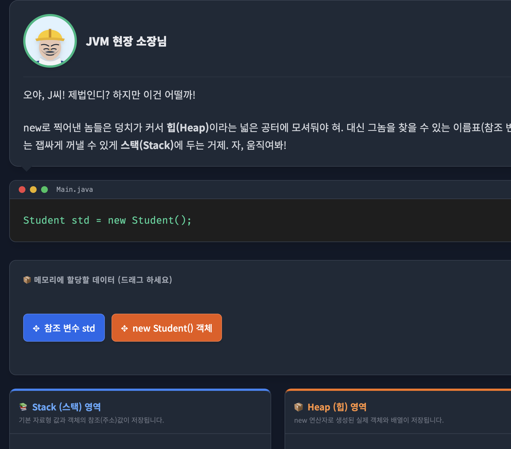

# gemini-canvas-mission

Gemini Canvas 미션 결과물을 관리하는 저장소입니다.

## 목적

- Gemini Canvas로 제작한 웹앱 결과물을 기록하고 공유합니다.
- 앱별 요구사항, 배포 링크, 회고를 일관된 형식으로 남깁니다.

---

## 목차
- [유틸리티 앱: 시스테밀](#앱-이름-시스테밀systemeal)
- [학습 앱: 이쟈부터 네 이름은 JVM이여](#앱-이름-이쟈부터-네-이름은-jvm이여you-jvm-ok)
- [게임: 나를 찾아줘](#앱-이름-나를-찾아줘find-me)
- [페어 프롬프트 릴레이: 우테코 밥친구](#앱-이름-우테코-밥친구)

---

## 앱 이름: 시스테밀(Systemeal)

## 카테고리: 유틸리티 앱

### 배포 링크

https://gemini.google.com/share/5a4e9d266fcc

### 이 앱을 만든 이유

- **어떤 문제/불편함을 해결하려고 했나요?**
  ```text
  기존에는 아래 첨부한 사진과 같이 노션의 표 기능을 이용하여 직접 횟수를 업데이트했다.
  이 과정에서 횟수를 쓰고 지우는 불편함과 더불어 "내가 횟수를 증가시켰나?"하는 헷갈림으로 인한 오류 위험까지 있었다.
  또한 한 요리에 포함되어 횟수를 공통으로 증가시키면 되는 여러 식재료가 있음에도 불구하고 개별적으로 관리해야 되는 비효율도 있었다.
  
  위에서 언급한 세 가지 문제/불편함을 해결하기 위해 버튼을 통한 증가 기능, 여러 식재료를 '요리'라는 상위 항목에 포함시키는 기능 등을 구현했다.
  ```
  

- **이 앱을 언제, 어떻게 사용할 건가요?**
  ```text
  자취 시작 이후 아침과 저녁 메뉴를 매번 동일하게 구성하여 요리하고 있다.
  각 요리 과정에서 클릭 한번으로 내가 사용하는 식재료의 사용 횟수를 관리함으로써 영양소와 비용을 시스템화할 것이다.
  ```
  
### 주요 기능

- 항목(식재료, 요리) 등록/삭제
- 요리의 하위에 식재료 등록

### 미리보기


---

## 앱 이름: 이쟈부터 네 이름은 JVM이여(you, jvm. ok?)

## 카테고리: 학습

### 배포 링크

https://gemini.google.com/share/e93752d09e5c

### 이 앱을 만든 이유

- **어떤 문제/불편함을 해결하려고 했나요?**
  ```text
  JVM 메모리 구조를 학습해서 익히더라도 우테코 미션을 수행하는 등의 평소 생활에서 그 구조를 매번 상상하며 코드를 작성하지는 않는다.
  그래서 학습후 얼마간은 구조를 다 이해했다는 생각이 들지만, 시간이 더 지나고 나면 어느덧 헷갈리기 시작한다.
  
  반복과 시각적 자극이라는 좋은 학습법을 결합해서 헷갈리는 주기를 점점 늘려보자!
  ```

- **이 앱을 언제, 어떻게 사용할 건가요?**
  ```text
  일상을 지내다보니 어느덧 JVM 메모리 구조가 헷갈릴 때 가벼운 마음으로 사용하겠다.
  ``` 

### 미리보기



---

## 앱 이름: 나를 찾아줘(find me)

## 카테고리: 게임

### 배포 링크

https://gemini.google.com/share/af61d1ec5166

### 이 앱을 만든 이유

- **어떤 문제/불편함을 해결하려고 했나요?**
  ```text
  10개월간 동고동락할 크루원들이지만, 물리적/시간적 한계로 인해 짧은 시간만에 모두와 친해지기는 어렵다.
  누구나 한번쯤 즐겨봤을 '같은 그림 찾기' 게임으로부터 영감을 받아 크루원의 닉네임과 슬랙 프로필 사진을 올바르게 짝지으며 내적 친밀감을 쌓도록 의도했다.
  ```

- **이 앱을 언제, 어떻게 사용할 건가요?**
  ```text
  자취 시작 이후 아침과 저녁 메뉴를 매번 동일하게 구성하여 요리하고 있다.
  각 요리 과정에서 클릭 한번으로 내가 사용하는 식재료의 사용 횟수를 관리함으로써 영양소와 비용을 시스템화할 것이다.
  ```
  
### 주요 기능

- 카드 짝을 올바르게 맞추면 점수를 부여하고, 계속 맞출 기회를 얻는다.
  - 연속해서 맞추는 경우에는 콤보 점수를 추가로 부여한다.
- 카드 짝을 틀리면 점수를 감점한다.
- 랭킹 시스템을 통해 다른 사용자들과 경쟁한다.

### 미리보기


---

## 앱 이름: 우테코 밥친구

## 카테고리: 페어 프롬프트 릴레이

### 배포 링크

https://gemini.google.com/share/43eba2cdca1d

### 이 앱을 만든 이유

- **어떤 문제/불편함을 해결하려고 했나요?**
  ```text
  인간은 위기에 직면했을 때 이를 극복하며 성장한다.
  갑자기 타인과 밥을 먹어야 되는 위기(?)를 극복하며 소프트 스킬에 능숙해지자.
  ```

- **이 앱을 언제, 어떻게 사용할 건가요?**
  ```text
  팀/페어 미션으로 인해 결속을 다져야 하거나 식사시간 때 회의를 해야될 경우를 제외하고는 새로운 크루들과 밥친구를 통해 결속을 다질 예정이다.
  ```

### 주요 기능

- 사용자가 설정한 속성에 따라 밥친구를 매칭한다.
  - 설정 속성
    - 오늘 밥친구를 통해 매칭되기를 원하는지 여부
    - 선호하는 식당
- 속성이 맞는 사용자의 수가 적어 매칭이 어려울 경우에는 다른 속성의 사용자와 함께 매칭한다.

### 미리 보기


### 페어 프롬프트 릴레이 회고

#### 페어

[@아론](https://github.com/sun007021)

#### 회고

혼자서 AI 프롬프트를 작성할 때도 나름 빠뜨리는 부분없이 섬세하게 작성한다고 생각을 했었다.

하지만 (당연하게도) 나와는 관점과 시각이 다른 페어가 옆에서 네비게이터 역할을 하니 내가 놓쳤던 부분들이 있음을 인지할 수 있었다.

내 경우에는 관리자 계정에서 사용자들의 설정값만 변경할 수 있도록 하면 된다고 판단했지만,
페어가 관리자 화면에서 즉시 밥친구 매칭을 할 수 있는 기능이 있어야 테스트가 편할 것이라고 제시해준 것이 그 예이다.

AI 활용으로 1인 생산성이 증가한다고 이전에 하던 인간 동료와의 협업이 불필요한 것이 되지는 않는다.

이번 릴레이 경험처럼 한 사람의 관점만으로 AI에게 프롬프팅을 한다면 AI역시 항상 비슷한 연산만을 수행할 뿐이다.

결국 좋은 프로덕트를 만들기 위해서는 다양한 경우와 목표 사용자들을 고려해야 하며, 출시 전 우리 주변에서 가장 빠르고 신뢰도 높은 사용자는 동료일 확률이 높다.

---

## AI 사용 일지

대상 앱: 시스테밀(Systemeal)

### 1. 초기 프롬프트

```markdown
# 서론

반갑다. 내가 자취를 시작한 이후로 알리오올리오와 닭가슴살 구이 등 아침과 저녁을 조리해서 먹고 있어.

이 과정에서 식재료를 얼마에 샀고, 얼마나(몇 회 또는 며칠, 몇 달) 사용할 수 있는지 체계적으로 관리하고 싶은 욕구가 생겼어.

그래서 기존에는 첨부한 사진처럼 표로 관리했는데, 이렇게 하니까 횟수 카운팅도 내가 하나하나 지웠다가 적어야 되고, 가끔 카운팅을 한 건지 아닌지도 헷갈리더라고.

내 욕구를 충족시키면서도 기존의 표 관리의 불편함을 해소할 수 있는 유틸리티 앱을 만들고 싶어.

아래에서는 내 요구사항을 더 체계화해서 전달해줄게.

# 기술 스택

- JavaScript나 React를 위주로 제미나이 앱으로 바로 배포할 예정이고, 모바일 사용자도 사용하는데 문제가 없게끔 하는게 목표야.

# 필수 기능

- 휴지통을 **비우거나**, 휴지통에 있는 식재료를 **복원**한다.
- 등록된 식재료를 **관리**한다.
    - 기존 속성을 수정한다.
    - 사용 횟수 속성을 버튼을 눌러 1만큼 증가시킨다.
        
        *1보다 큰 횟수만큼 증가시키거나, 감소시키기를 원한다면 수정 기능을 이용한다.
        
- 관리할 식재료를 **등록/삭제**한다.
    - **등록**시에는 이름, 구매 가격, 구매 링크를 설정할 수 있다.
    - **삭제**한 식재료는 휴지통으로 이동한다.
- 식재료는 **이름(필수)**, **구매 가격(선택)**, **구매 링크(선택)**, **사용 횟수(초기값 0)**를 속성으로 가진다.
    - 사용 횟수 속성은 마지막 수정 기록(날짜, 시각, 수정 정보(직전 값으로부터의 증가/감소량))을 포함한다.
    - **속성값 제한**
        - 이름은 20자를 초과할 수 없다.
        - 구매 가격
            - 음수일 수 없다.
            - int 범위 내여야 한다.
        - 구매 링크는 500자를 초과할 수 없다.
        - 사용 횟수
            - 음수일 수 없다.
            - int 범위 내여야 한다.

# UI, UX

- 메인 화면에서는 등록한 식재료를 **최근 추가순**으로 하여 **리스트 형태**로 나타낸다.
    - 각 리스트 항목의 우측에는 **순서를 사용자 지정으로 변경**할 수 있는 가로줄 세 개 아이콘이 상-하로 위치한다.
        - 해당 아이콘 부분을 클릭하여 움직이면 해당 리스트 항목의 순서를 변경할 수 있다.
- 닭가슴살, 기름(올리브유), 파스타, 새우 등 기본적인 식재료에 대한 **작은 아이콘을 앱에서 기본으로 제공**한다. 사용자는 이를 이용하여 식재료를 직관적으로 확인할 수 있다.

# 제한 사항

- 아직 없음
```

### 2. 프롬프트 개선 과정

- 문제 상황: 버리기 기능을 식재료 상세 설정 화면으로 진입해야만 사용할 수 있어서 불편함
  - 해결: 메인 화면에서 식재료 리스트 항목을 좌에서 우로 밀었을 때도 휴지통 아이콘이 나타나도록 요청

- 문제 상황: 부제목에 구매한 제품명 전체를 작성하려고 하는데, 20자로 부족한 경우가 많았음
  - 해결: 글자 수 제한을 50자로 상향 조정

- 문제 상황: 해당 식재료와 관련된 설명을 적을 곳이 없음
  - 해결: 상세 설명 속성을 추가

- 문제 상황: 닭가슴살로 사용하려던 아이콘이 치킨같이 보임
  - 해결: 닭가슴살 아이콘에 대한 레퍼런스를 전달하며 수정 요청

### 3. 효과적이었던 프롬프팅 전략

- 효과가 있었던 방식: AI가 공유 DB를 제대로 설정하지 못한다는 답변을 줬을 때,
  gemini canvas 고객센터의 'firebase의 공유 기능을 통해 여러 사용자가 데이터를 공유 가능...' 문구를 근거로 제시하며 재요청하니 목표를 달성할 수 있었음
- 효과가 없었던 방식(위 경우와 연계): 단순히 '여러 사용자가 사용할 수 있도록 해달라'고 요청하니 목표를 제대로 달성하지 못함

### 4. 배운 점

변경할 부분, 유지할 부분 등을 명확히 정해주자. 달성하고 싶은 목표를 도울 수 있는 도구에 대한 공식문서를 근거로 첨부하면 AI가 해당 정보를 활용하여 더 좋은 결과물을 낸다.

### 5. 리뷰어에게 피드백 받고 싶은 포인트

안녕하세요, 리뷰어님!

AI에게 프롬프트로 전달할 공식 문서나 이미지 레퍼런스 등을 찾는 행위에 사용하는 시간을 더 줄일 방법이 없을지 알고 싶습니다.

현재 생각으로는 'ㅁㅁ 공식 문서 참고해서 구현해'와 같이 '공식 문서를 찾는 것까지 AI에게 일임하면 생산성이 늘어나지 않을까'하는 생각과,
'그래도 공식 문서 정도는 내가 직접 확인하고 전달해야 오류를 일으킬 가능성이 적고, 하는 김에 공식 문서 읽는 법에 대한 훈련도 할 수 있다'는 생각이 공존하고 있습니다.
