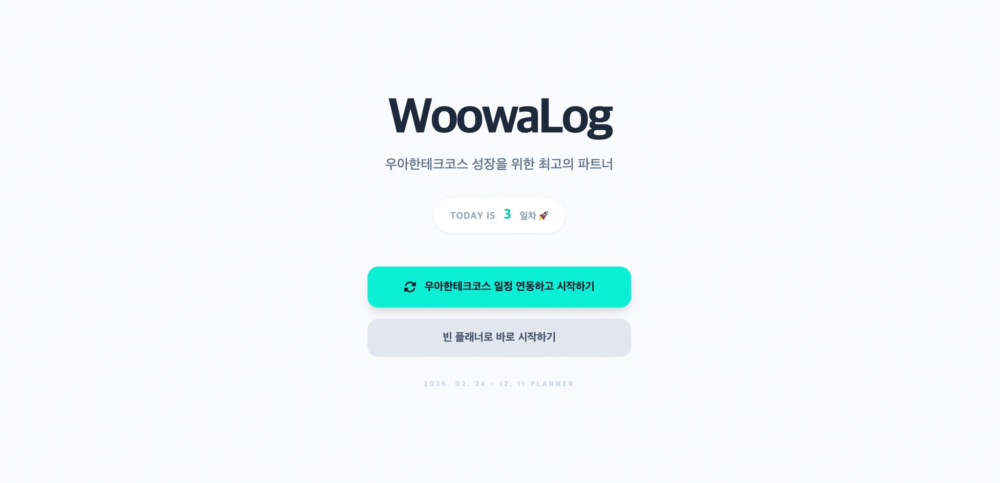
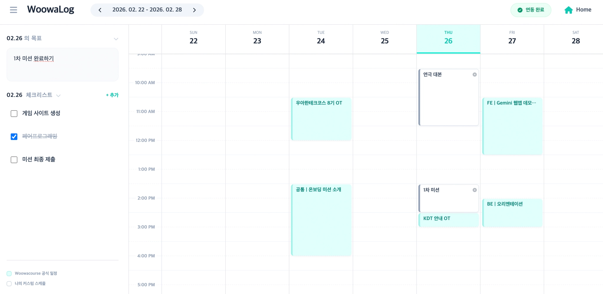
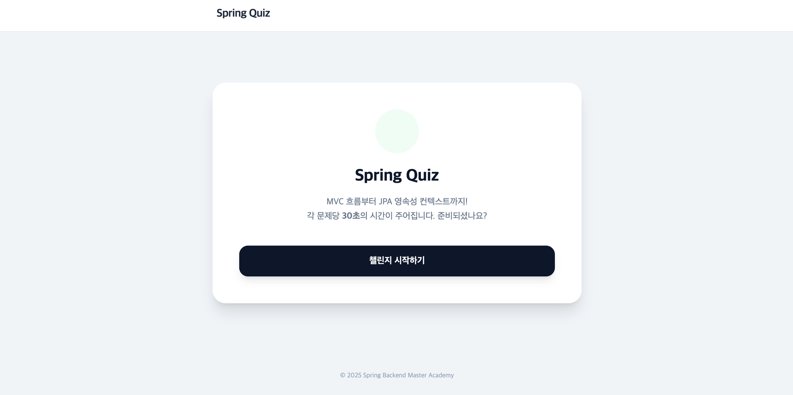
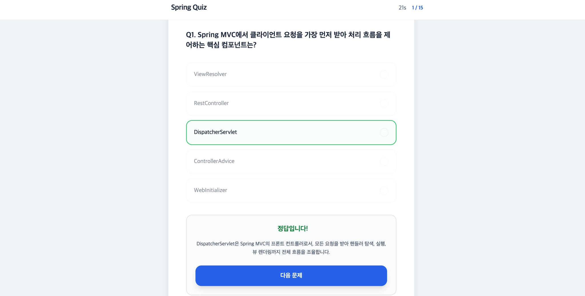
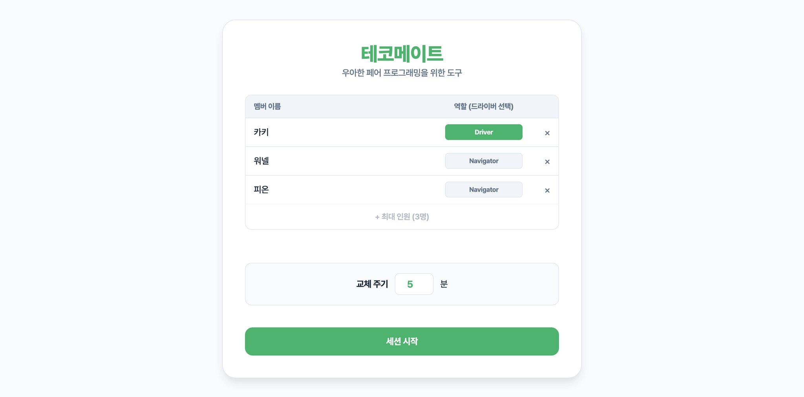
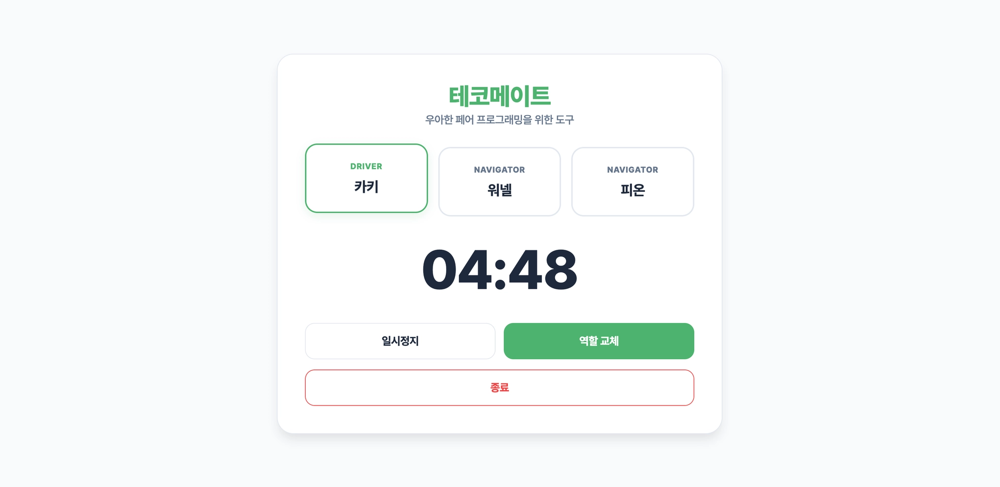

## 💻 1. 유틸리티 앱

  
  

### 앱 이름

WoowaLog

### 배포 링크

https://gemini.google.com/share/d23bd7a160f5

### 이 앱을 만든 이유

공식 일정과 개인 학습 일정을 함께 관리하기 어려운 문제를 해결하기 위해, 공식 일정을 고정된 배경처럼 두고 개인 일정을 직관적으로 배치할 수 있는 전용 플래너를 제작했습니다. 이를 통해 학습 일정 관리의 효율성과 가시성을 높이고자 했습니다.

### 주요 기능

- 공식 일정 자동 동기화 및 시각적 구분
- 드래그 기반 일정 생성 (30분 단위)
- 날짜별 목표 및 체크리스트 관리
- Firebase 기반 데이터 저장

---

## 🎮 2. 게임

  
  

### 앱 이름

Backend Rain

### 배포 링크

https://gemini.google.com/share/4d1604f9f34a

### 이 앱을 만든 이유

백엔드 개발에서 자주 사용되는 기술 용어를 게임 형태로 익힐 수 있도록 하여, 학습 부담을 줄이고 재미와 몰입도를 높이기 위해 제작했습니다.

### 주요 기능

- 백엔드 용어 기반 단어 생성 시스템
- 점진적 난이도 상승 로직
- 생명력 및 보너스(힐링) 시스템
- 실시간 텍스트 매칭 및 점수 계산
- 게임 종료 후 결과 리포트 제공

---

## 📚 3. 학습 앱

  
  

### 앱 이름

Spring Quiz

### 배포 링크

https://gemini.google.com/share/c5b1b377d4dc

### 이 앱을 만든 이유

추상적인 백엔드 개념을 퀴즈 형식으로 학습하여 이해도를 즉각적으로 점검하고, 면접 대비 및 복습 효율을 높이기 위해 제작했습니다.

### 주요 기능

- Spring/JPA 등 핵심 개념 기반 15문항 퀴즈
- 문제당 30초 제한 시간
- 정답 선택 시 즉각적인 해설 제공

---

## 🤝 4. 페어 프롬프트 릴레이 앱

  
  

### 앱 이름

테코메이트

### 페어

@EveryPine @jeonwonjun

### 배포 링크

https://gemini.google.com/share/d21b84ef7372

### 이 앱을 만든 이유

페어 프로그래밍 중 역할 교체 시점을 놓치는 문제를 해결하고, 명확한 역할 순환과 알림을 통해 협업 몰입도를 높이기 위해 제작했습니다.

### 주요 기능

- 참여자 추가 및 관리 기능
- 드라이버/네비게이터 자동 순환
- 커스텀 타이머 설정
- 시각 및 음성 기반 알림 시스템

### AI 기능

Gemini 2.5 Flash TTS를 활용해 역할 교체 1분 전에 음성 안내를 제공하는 기능을 구현했습니다.

**AI 기능 역할**

- 작업 마무리를 돕는 사전 음성 알림 제공
- 시각적 확인 없이도 시간 인지가 가능해 몰입 유지
- 음성 캐싱을 통한 지연 없는 안정적인 안내