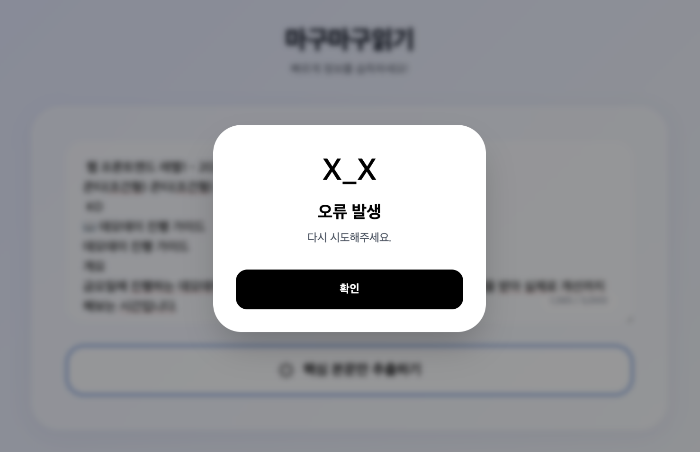
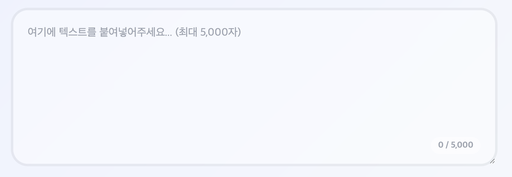
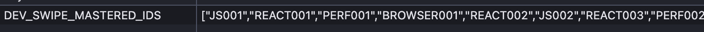

# gemini-canvas-mission

Gemini Canvas 미션 결과물을 관리하는 저장소입니다.

## 목적

- Gemini Canvas로 제작한 웹앱 결과물을 기록하고 공유합니다.
- 앱별 요구사항, 배포 링크, 회고를 일관된 형식으로 남깁니다.

## 내가 만든 앱

### 💻 마구마구읽기
[](https://gemini.google.com/share/128e40677fe9)


### 🎮 트론 아레나(TRON ARENA)

[](https://gemini.google.com/share/4a022ec222fc)

### 📚 스와이피(swapy)

[](https://gemini.google.com/share/419b4b0e426f)

### 🤝 블로그 메이트 (blog-mate)
[](https://gemini.google.com/share/a315f554aad6)

## 피드백

### 마구마구읽기

수정본 URL : https://gemini.google.com/share/128e40677fe9


#### 조원들의 피드백

> 길이가 긴 글을 읽을 때, 이 앱을 사용하면 글을 잘 정독할 수 있을 것 같아요!
다만 한 단어 당 최소 속도가 짧아 빨리 읽히는 것 같아서 속도 범위를 좀 더 넓혀도 좋을 것 같습니다.

#### 프롬프트 

속도값을 조정하고 따옴표가 있다면 없애지 말고 차례차례 나오게 요청했습니다.
```
속도조절의 범위를 10ms에서 1000ms까지 조정하고
기본 속도는 340ms로 설정해줘


따옴표가 있는 경우 
"
"여기
"여기 사람이
"여기 사람이 있어요"
이런식으로 앞 문장을 안없애면서 생성되게해줘
차례차례 나오는건 6글자 이후 부터 해줘 (괄호나 따옴표)
```


#### 리뷰어의 재생 속도 피드백
> 개인적으로는 텍스트 재생 속도가 동적으로 변하는 기능이 들어가도 재밌겠다고 느꼈습니다. 계속 같은 속도로 흐르면 눈이 금방 적응해버리는데, 시간이 지날수록 점점 빨라지거나, 점점 느려지는 모드가 있으면 사용 경험이 더 풍부해질 것 같아요.


#### 프롬프트 
열번 중 한번은 가속 효과를 바꿔 시선을 끌도록 했습니다.
ease-in의 경우 가속이 느려 눈에 보이게 되는 지점이 늦어 ease-Out으로 결정하였습니다.

```
열번에 한번씩은 효과를 주려고해(심심하지않게)
1. easeOutExpo 
2. easeInOutQuad
3. easeOutQuint
4. easeOutElastic
네개중에 하나 골라쓰고 지속 효과를 두배로 해줘
```


#### 리뷰어의 네트워크 에러 피드백
>의도된 동작일지 모르겠으나, 네트워크 에러가 발생하면 아래와 같이 에러 메시지가 텍스트로 나타납니다.   

>재현루트) 한글입숨 문단 20개이상 생성해서 붙여넣으면 간헐적으로 재현됩니다 ㅎㅎ

#### 프롬프트

```
네트워크 에러가 발생한다면 재생하지말고 "x_x" 이모지를 날리고 확인을 누르면 다시 처음으로 돌아가서 재시도를 요청해
```


추가로 너무 많은 텍스트가 들어왔을 때 생기는 문제점을 위해 글자수의 제한을 걸었습니다.(5,000자)




### swapy

수정 URL : https://gemini.google.com/share/419b4b0e426f

#### 로컬 스토리지 권유 피드백
> 다만 학습용 앱임을 고려하면, 로컬 스토리지와 같은 브라우저 저장소를 활용해서 이전의 기록이 계속해서 이어질 수 있도록 한다면 더 좋은 사용 경험을 이끌어낼 수 있을 것 같아요.

#### 프롬프트

로컬 스토리지를 활용해서 키워드가 저장되고 확인하였습니다
다른 질문을 하는 지 확인하였습니다
```
사용자의 로컬 스토리지를 활용해서 키워드를 저장하고 이미 알고있는 키워드는 많이 안 나오게 수정해줘 
```

