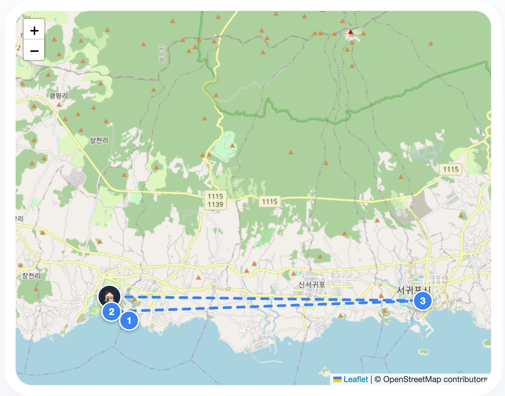
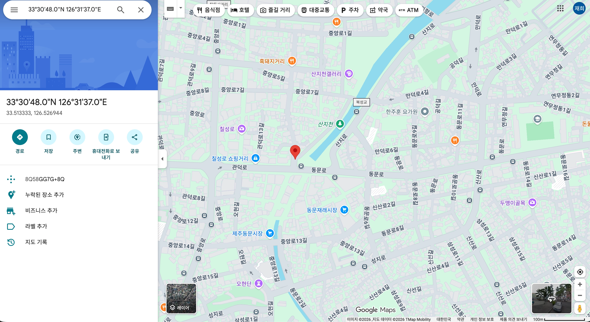

## 앱 이름: **AI TRAVEL PLANNER**

## 카테고리: 유틸리티 앱

### 배포 링크
https://gemini.google.com/share/3661ce672be1

### 이 앱을 만든 이유

- 처음 가보는 여행지를 갈 때 어떻게 일정을 짜야하지 하는 막막함을 해결하고자 했다.
- 해당 앱을 사용하면 여행 일정에 대한 밑그림을 빠르게 그릴 수 있다.

### 주요 기능
> (AI 기능의 경우 🤖가 붙어있습니다.)

- 여행지 이름, 숙소 위치, 여행 스타일, 여행 기간을 입력

    
- 🤖AI가 입력 받은 정보를 고려해서 적절한 여행 일정을 생성
    - 생성된 여행일정은 하단 지도에 마커로 표시된다.
  
        
  
- 일자별로 일정을 순서대로 인할 수 있다.

  
  
  - 클릭시 해당 장소의 구글맵 링크로 이동
  
    