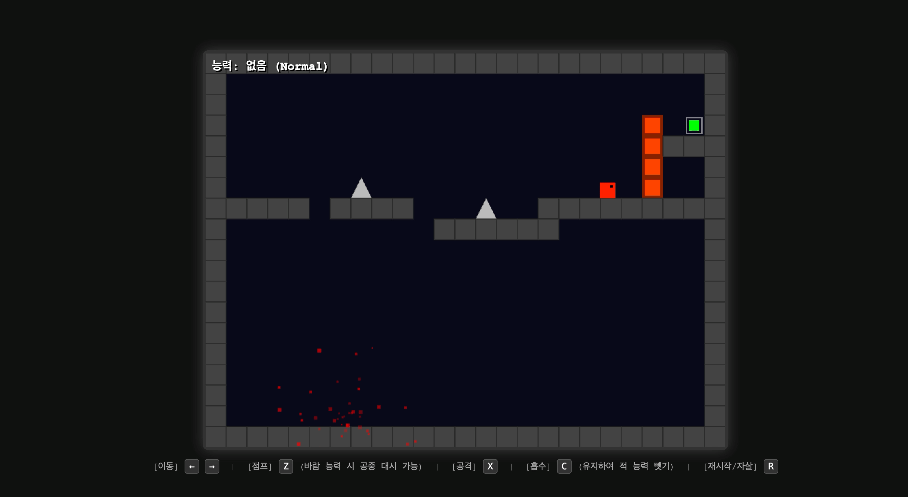

## 앱 이름: [I Wanna Be The Slime]
## 카테고리: [게임]

### 배포 링크
[I wanna Be The Slime 링크 바로가기](https://gemini.google.com/share/a828ee490c1c)

### 데모 영상

### 이 앱을 만든 이유
웹을 기반으로 하는 게임의 경우 마우스를 기반으로 게임이 진행되는 경우가 많다고 생각했습니다. 따라서 키보드를 기반으로 작동할 수 있도록 "별의 커비"라는 게임으로부터 착안하여 횡스크롤 플랫폼 게임을 구축하였습니다.

사용자가 사용하였을 때 재미를 위해 난이도를 어렵게 조절하여, 계속해서 도전해서 승부욕을 불러 일으키도록 구성하였습니다. 또한, 적의 기능을 흡수하는 기믹과 퍼즐처럼 풀 수 있는 장치를 두어 사용자가 흥미를 잃지 않게끔 구성하였습니다.

### 주요 기능
- 메인 캐릭터를 좌/우로 움직이는 기능
- z를 누르면 점프하는 기능
- x를 누르면 공격하는 기능 (슈팅)
- c를 누르면 적의 능력을 흡수하는 기능
- r을 누르면 재시작하는 기능
- 빨간색 몹을 흡수하면 빨간색 벽을 삭제할 수 있음
- 파란색 몹을 흡수하면 점프 중 대시가 가능
- 보스를 잡으면 게임 종료

# 프롬프트
## 초기 프롬프트
나는 게임을 만들거고, 너는 이제부터 내가 게임을 만들기 위해 도와주는 시니어 게임 개발자야. 이제부터 나는 I wanna be the boshi, 별의 커비와 비슷한 부류의 아케이드 게임을 만들고 싶어.  다음의 모든 정보를 종합적으로 모두 고려하여 구현하라. 그 외의 기재하지 않은 항목에 대해서는 상상력을 발휘하여 구현하라.

[목표 사용자]

- 10~30대 플랫폼 게임 팬
- 짧은 세션의 게임을 선호하는 사용자
- 반복 도전을 즐기는 플레이어

[개요]
2D 픽셀아트 횡스크롤 액션 플랫폼 게임.
'I Wanna Be The Boshi'처럼 정밀 점프 기반 고난이도.
하지만 '별의 커비'처럼 캐릭터 능력 흡수 시스템 존재

[핵심 기능]

1. 정밀 점프 기반 즉사 트랩 시스템
2. 적 능력 흡수 후 단일 능력 장착 시스템
3. 즉시 리스폰 구조 (빠른 재도전을 위해서)
4. 플레이어는 공격을 할 수 있다. (횡의 방향으로 슈팅을 한다)
5. 적은 공격을 받으면 죽거나 체력이 단다.

[성공 기준]

- 플레이어가 첫 스테이지를 5분 내 클리어 가능해야 한다.
- 사망 후 1초 이내에 리스폰이 이루어져야 한다.
- 점프 입력 반응 지연은 50ms 이하로 설계한다.
- 플레이어가 능력을 사용하지 않으면 특정 구간을 통과할 수 없어야 한다.
- 보스는 최소 2페이즈 패턴을 가진다.
- 맵은 세 개 이상이어야 한다.

[구현 제약 및 추가 요구사항]

- JS, HTML, CSS를 가지고서만 만들어야 한다.
- 서버 통신 금지
- 외부 유료 API 사용 금지
- 3D 그래픽 금지
- 운 요소 포함 금지
- 맵은 세 개 이상이어야 함.
- 흡수, 폭발, 죽음 등의 모든 효과는 도트로 나타나야함.
- 캐릭터 에셋은 CSS를 기반으로 상상해서 창의적으로 만든다.

## 추가 프롬프트
### 1.

두 번째 맵에서 다리가 짧아서 다음 맵으로 가는 입구로 도달을 할 수가 없어. 두번째 맵의 가시 개수를 좀 줄이거나 길을 늘리는 편이 좋을 거 같아. 약 두 ~ 세 칸 정도의 차이 때문에 넘어가지 못하고 있으니, 이를 참고해서 수정해

### 2.

보스의 두 번째 페이즈에서 화염 몬스터 흡수를 해야하는데 메인 캐릭터가 있는 위치의 바닥 아래부분에 적이 스폰되어서 흡수가 안 돼. 이를 수정해줘. 또한, 보스를 공격하는 부분에서 맞았는데 보스의 체력이 줄지 않거나 메인 캐릭터가 슈팅한 탄막이 사라지는 경우들이 존재하는데 이 원인을 분석해서 해결해

### 3.

현재 보스의 패턴이 너무 단조롭다는 문제가 존재해. 보스의 두 번째 페이즈에서는 메인 캐릭터한테 유도탄을 던지는데 속도가 조금 더 빨라야해 지금보다, 또한 두 번째 페이즈의 보스의 공격은 벽을 뚫고 지나가야해. 또한, 적은 계속해서 리스폰돼서 메인 캐릭터를 찾아서 계속해서 움직여야해. 또한 보스는 두 번재 페이즈가 되면 움직이는 것에 변화를 줘 예를 들어 맵오른쪽에서 중간중간 왼쪽으로 이동한다던가 하는 기믹들을 말이야

### 4.

미션이 끝나면 축하한다고 폭죽을 터트리고 다시 시작하기 버튼을 만들어서 버튼을 누르면 첫 번째 맵으로 이동시켜줬으면 좋겠어

### 5.

근데 맵이 세 개 인거잖아. 그 대시능력을 사용하는 맵을 하나 만들어서 보스전 바로 앞에다가 새로 만들어서 총 4개의 맵을 사용하게 해줘. 새로 만드는 맵은 대시능력과 불 능력을 모두 사용해야만 풀 수 있는 맵으로 해줬으면 해. 떨어지면 죽게해줬으면 좋겠고

### 6.

현재 세번째 맵에서 대시의 길이가 짧아서 빨강 몹이 있는 발판에 도달하지 못해. 빨간 몹이 있는 발판을 조금 더 길게 만들거나 빨간 발판을 도달하기 전 바로 발판을 조금 더 길게 해줬으면 해

### 7.

세번째 맵에서 마지막에 빨간색 벽이 너무 낮아서 메인 캐릭터가 그냥 점프로 넘어가져, 그러니 그냥 벽을 맨 윗 블럭까지 다 쌓아서 사용할 수 있게 해줘. 또한 빨간색 몹을 잡고 출구까지 가는 길에 위 아래로 움직이는 새로운 적 하나를 두고 그걸 피해가게끔 설계해서 다시 재작성해줘.