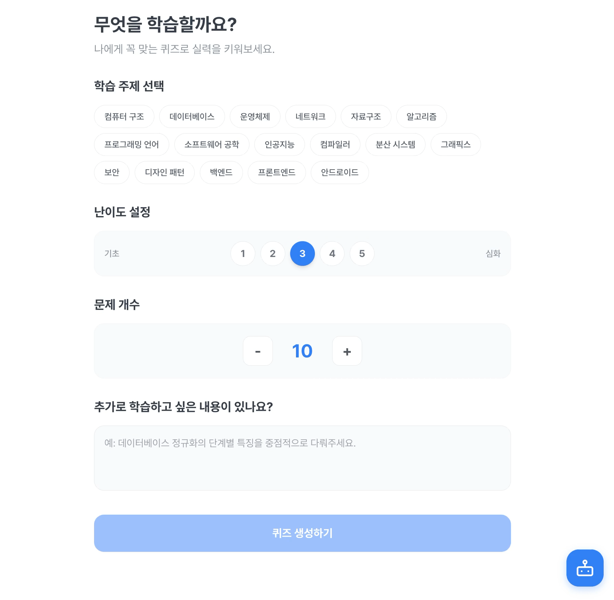

## 🤝 페어 프롬프트 릴레이 앱
### 앱 이름
### **마이 멘토**

### 페어 프롬프트 릴레이 멤버
@2jaeheon (초록)
 
@jihyun3478 (로지)

### 배포 링크
[my-mento 바로가기!](https://gemini.google.com/share/b90b3877f71b)

### 데모 영상

### 이 앱을 만든 이유
학습을 하는 경우 공부를 했지만, 이를 따로 내재화시키지 않으면 머릿속에 장기기억으로 저장되지 않는 문제점이 있습니다. 따라서 개인이 학습한 내용에 대해서 점검할 필요가 있었습니다.

따라서 CS학습을 위해 공부한 내용을 개인 맞춤형으로 테스트하고 싶다는 서로의 니즈를 반영하여, CS 학습 퀴즈 애플리케이션을 구축하였습니다.

또한, 문제를 풀다 추가적인 학습 및 기억이 안 나는 경우에 다시 공부를 하는 대신 정돈되지 않은 지식들을 머릿속에서 스스로 내재화시킬 수 있도록 "소크라테스 챗봇"을 구축하였습니다. 사용자는 "소크라테스 챗봇"을 이용하여 더 깊게 생각해보고 고민해볼 수 있습니다.

#### 목표
사용자의 수준에 맞춘 적절한 난이도의 CS 문제를 출제하고, 사용자가 학습한 분야에 대해서만 학습하는 것이 목표입니다. 또한, 퀴즈를 통해 정돈되지 않는 학습된 내용을 장기기억으로 전환하는 것을 돕습니다.

#### 언제 사용할까요?
- 특정 학습을 진행한 이후에 개념 및 원리에 대해서 정리하고 싶을 때
- 공부를 했는데, 막상 기억에 남는 것이 많지 않을 때

#### 어떻게 사용할까요?
1. 공부를 한 이후 대목차와 세부 목차를 선택한 뒤, 세부사항을 서술형을 적습니다. (본인이 공부한 것 및 테스트하고 싶은 것)
2. AI가 문제를 생성해주면 문제를 풉니다.
3. 생각이 안 나거나 깊이 학습하고 싶다면 소크라테스 챗봇 버튼을 이용하여 산파술을 통해 정답을 도출하거나 부족한 부분을 학습합니다.

### 주요 기능
#### 기능 1
- 데이터베이스/운영체제/네트워크 등 대목차와 세부 목차, 난이도를 선택하면 Gemini AI가 O/X, 4지선다 객관식, 주관식을 적절히 섞어 총 10문제를 자동 생성합니다.
#### 기능 2
- 문제 풀이 중 모르는 부분이 생기면 챗봇에게 질문할 수 있으며, 챗봇은 정답을 직접 알려주지 않고 사용자가 스스로 답을 도출할 수 있도록 질문으로 유도합니다.

### AI 기능
#### 어떤 AI 기능을 추가했나요?
- Gemini AI를 활용한 퀴즈 문제 자동 생성 + 소크라테스 문답법 기반 챗봇

#### AI 기능이 앱에서 어떤 역할을 하나요?
- 사용자가 선택한 주제, 난이도, 추가로 학습하고 싶은 내용을 바탕으로 오류 없는 퀴즈를 생성하고, 챗봇은 학습자가 막히는 지점에서 “왜 그렇게 생각하나요?“, “그렇다면 이 상황에서는 어떻게 될까요?” 같은 방식으로 깊이 있는 사고를 이끌어냅니다.