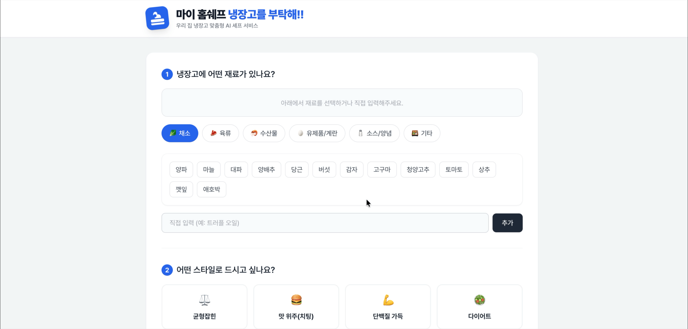

## 💻 유틸리티 앱
### 앱 이름
### **마이 홈쉐프 - 냉장고를 부탁해!**

### 배포 링크
[마이 홈쉐프 - 냉장고를 부탁해 바로가기!](https://gemini.google.com/share/550c035f7adf)

### 데모 영상

### 이 앱을 만든 이유
- 어떤 문제/불편함을 해결하려고 했나요?
    - 냉장고에 있는 한정된 재료를 사용해 맛있는 한 끼를 먹고싶은데, 어떤 음식을 어떻게 요리할지 막막할 때 사용할 수 있는 애플리케이션을 개발하고자 했습니다.
- 본인이 이 앱을 언제, 어떻게 사용할 건가요?
    - 자취를 하며 혼자 끼니를 해결해야 할 때, 식비를 최대한 절약하기 위해 냉장고에 있는 재료만 활용하고 싶을 때 직접 사용해보려 합니다.

### 주요 기능
- 기능 1
    - 카테고리별로 현재 냉장고에 있는 재료를 선택하거나, 직접 추가할 수 있습니다.
- 기능 2
    - 원하는 식단 스타일(균형잡힌/치팅데이/단백질 가득 등)과 종류(반찬, 찌개, 볶음 등)를 선택하면, AI가 이에 맞는 레시피와 영양 정보를 함께 추천합니다.

### AI 기능 (해당되는 경우)
- 어떤 AI 기능을 추가했나요?
    - Gemini AI를 활용한 맞춤형 식단 추천 및 영양 성분 분석 기능을 추가했습니다.
- AI 기능이 앱에서 어떤 역할을 하나요?
    - 사용자가 입력한 재료, 식단 스타일, 종류를 종합해 현실적으로 만들 수 있는 요리를 추천하고, 해당 메뉴의 칼로리/단백질/탄수화물 등 영양 성분을 상세히 제공합니다.
