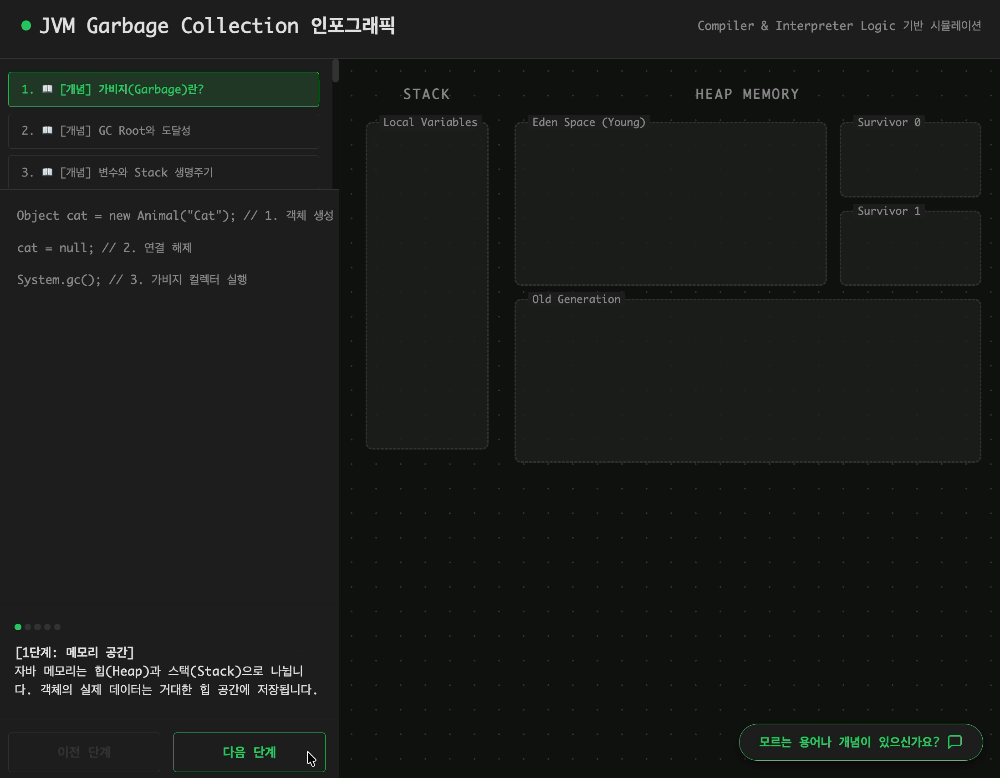

## 앱 이름: [GC-Inside]
## 카테고리: [학습 앱]

### 배포 링크
[GC-Inside 바로가기!](https://gemini.google.com/share/e414282ebde2)

### 데모 영상

### 이 앱을 만든 이유
GC의 경우에는 시각화가 이루어지지 않는 경우에 어떻게 동작하고 무엇이 일어나는지를 확인하기 어렵다고 생각합니다. 따라서 GC에 대해서 이해를 돕기 위해서 코드가 진행할 때 순차적으로 어떻게 동작하는지를 Stack, Heap 영역을 나눠 시각화를 통해서 확인할 수 있도록 구축하였습니다.

이를 통해서 GC가 어떻게 동작하는지 이해하고 학습하는 것을 목표로 합니다. 추가로 Stack, Heap영역에 대한 이해와 다양한 용어들에 대한 학습도 목표로 하고 있습니다.

추가적으로 AI를 통해서 모르는 용어나 개념이 나올 때 이해할 수 있도록 챗봇 기능을 두어 개인이 학습할 때 도움이 되도록 구성하였습니다.

### 언제 사용할건가요?
JVM과 GC에 대해서 학습할 때 사용합니다.

### 주요 기능
- 인포그래픽을 통해 어떻게 동작하는지에 대한 흐름을 실시간으로 보여준다.
- 각 용어에 대해 코드와 설명을 통해 순차적으로 GC개념에 대해서 설명한다.
- 다양한 GC 알고리즘 (SerialGC, CMS GC 등)을 학습하도록 도와준다.
- 코드에 대해 순차적으로 단계별로 동작하며 설명을 진행한다.
- AI 챗봇을 통해 모르는 기능을 설명한다.

### AI 기능
챗봇을 통해 모르는 기능 및 용어와 개념을 물어보고 학습에 대한 이해를 도와주도록 설계되었습니다. Gemini AI를 사용하여 개발되었습니다.

# 프롬프트
## 초기 프롬프트
GC(Garbage Collection)가 어떻게 동작하는지를 기반으로 학습 웹 애플리케이션으로 만들고 싶어. 너는 이제부터 컴파일러, 인터프리터, JVM 전문가로서 내가 앱을 만드는 것을 도와주면 돼. 다음의 모든 사항들을 기반으로 충분히 생각하고 시간을 보낸 뒤 구축해줘. 세부 목록은 대괄호 []를 통해서 구축하였으며, 이를 충분히 이해한 뒤 진행해줘.

[개요]

GC가 어떻게 동작하는지를 인포그래픽을 기반으로 설명하는 웹 애플리케이션이다. JVM 내부 상태를 시각화시켜 코드의 변화에 대해서 실시간으로 인포그래픽을 확인할 수 있어야 한다.

[목표 사용자]

- GC가 어떻게 동작하는지를 궁금해하는 우아한테크코스 크루 및 개발자

[핵심 기능]

- GC의 기본 원리를 인포그래픽으로 나타낸다.
- 코드 예시가 여러가지 있고 각 예시마다 GC가 어떻게 동작하는지를 인포그래픽으로 나타낸다.
- 실시간으로 자바코드를 선택하면, Young Generation과 Old Generation에서 객체가 생성되고 이동되는 과정을 인포그래픽으로 표현한다.
- 스택(Stack) 변수에서 힙(Heap) 객체를 가리키는 화살표를 표시하며 참조가 끊길 때 인포그래픽으로 나타낸다.

[성공 조건]

- 텍스트 설명 없이 인포그래픽만 보고도 GC 기본 원리에 대해 이해할 수 있어야 한다.
- 사용자의 반응에 즉각적인 피드백을 받을 수 있어야 한다.

[금지 및 제한 조건]

- HTML, CSS, JS만 사용한다.
- 색상은 무채색만 사용하며, 포인트 색상은 한 가지로 초록색이다.
- 너무 복잡한 바이트코드 수준의 설명보다는 메모리 레이아웃과 참조 흐름에 집중해야 한다.

## 추가 프롬프트
### 1.

조금 더 순차적으로 과정들을 이해하고 공부하고싶어. 현재는 코드 예제가 단순하지만 조금 더 어려운 예제들도 있으면 좋을것 같아. 그리고 그것에 대해서 여러 단계를 설명해줬으면 해. 또한, GC를 아예 모르는 사람도 이해할 수 없는 아주 쉬운 사이클의 예제도 존재했으면 좋겠어.

### 2.

현재 6가지의 케이스들이 있잖아?? 그 외의 7~10번까지의 예제도 추가할건데 그 예제들에 대해서는 실제 조금 긴 코드들에서 어떻게 동작하는지를 순차적인 난이도로 해서 구축하고 싶어. 실제 코드에서 어떤식으로 동작하는지를 제대로 확인할 수 있게끔 구축해줘.

### 3.

이제 긴 코드에서는 어떻게 동작하는지도 알고싶어. 그러니 11번부터 15번까지는 실제 자바 애플리케이션에서 사용되는 반복문, 함수형, 조건문, 등 다양한 요소들을 섞어서 GC 동작 원리에 대해서 이해해보고 싶어. 예제는 우아한테크코스 프리코스에서 학습했던 코드들의 예제로 해줬으면 해. 로또, 자동차, 숫자야구 등의 미션들의 코드를 발췌해서 이를 코드로 해서 적용시켜주면 좋을거 같아.

### 4.

현재 애플리케이션의 코드 예제의 설명이 조금 더 자세했으면 좋겠어. 조금 더 구체적인 설명으로 진행되면 더 좋을 것 같아.

또한 코드창에는 코드들이 있어야해. 주석으로만 가득 채우지는 말아줘. 최대한 코드레벨에서 이해할 수 있었으면 좋겠어. 모든 예제에 대해서 구체적으로 코드를 해줘. 코드가 너무 짧지 않아도 돼.

### 5.

현재 문제가 총 15개인데 1~5번을 용어를 설명하기 위한 예제로 만들고싶어. 나는 순차적으로 사람들이 예제를 눌러가면서 점진적으로 학습하였으면 하거든. 아주 기본적인 것부터 시작해서(Age, Eden, Old, Survior, MinorGC등)) 다른 용어들까지를 학습할 수 있었으면 좋겠어. 현재 존재하는 1~15번 문제들을 6~20번으로 바꾸고 (현재 1번은 가비지컬렉션 설명부터 하니 이니 그건 알아서 번호를 수정) 1~5번을 기본적인 용어 설명으로 해줘.

### 6.

현재 코드를 보여주는 창이 너무 작아. 예제를 선택하는 창이 너무 커서 코드칸이 좀 작다는 문제가 있어. 예제 선택 창의 크기를 더 줄여서 총 세 개정도의 블록만 보일 수 있게 해주고, 각각의 예제에 이모지를 빼줘. 

### 7.

현재는 궁금한 점이 생기면 따로 검색해볼 공간이 존재하지 않아. 따라서 Gemini AI를 사용하여 현재의 애플리케이션에 AI 챗봇 기능을 추가하고 싶어. 너는 이제부터 AI 챗봇 개발을 도와줘야 하는 AI 전문가야. 다음 모든 세부 사항들을 기반으로 하여 애플리케이션의 챗봇을 개발하여 적용시켜줘. 세부사항들에 대해서는 대괄호로 구분지어 놨으니, 모든 내용들을 완벽하게 숙지한 뒤 충분한 시간을 두어 생각하고 분석하여 의도를 파악한 뒤 구현에 임해줘.

### 8.

[개요]

궁금한 내용이 생길 때마다 필요한 정보를 물어볼 수 있는 AI 챗봇. Gemini AI를 기반으로 사용자는 궁금한 용어나 개념에 대해서 챗봇에게 물어보고 공부할 수 있어야 한다.

[핵심 기능]

- AI 챗봇 버튼 - 우측 하단에 고정된 (모르는 용어나 개념이 있으신가요?) 버튼을 만들어서 그걸 누를 때 챗봇 창이 떠야한다.
- 챗봇은 우측 하단의 채팅 창이어야한다. 모양은 카카오톡과 유사하게 하나, 위에서 언급했던 색상 가이드라인을 따른다. (무채색)

### 9.

현재 1,2,3,4,5,6,7,8,9에서 조금 더 기본 개념을 자세히 설명해줬으면 좋겠어. 순차적으로 배울 수 있게끔 말이야. Garbage가 무엇인지부터 시작해서 점차 어려워지게끔. 그리고 설명이 최대한 자세하게 해서 용어들도 배우고, 어떻게 작동되는지도 배울 수 있었으면 좋겠어 각 단계의 설명이 최소 5단계 이상으로 이루어지게끔 해줘.

### 10

가비지 컬렉션 알고리즘(마크앤스윕)등에 대해서도 자세한 설명이 있었으면 좋겠어. 이 알고리즘에 대해선 설명의 단계가 자세했으면 해. 설명이 10단계 이상으로 구성되어 종합적으로 어떻게 동작하는지를 21번으로 해줘. 또한 Serial GC, Parallel GC, Parallel Old GC, CMS GC, G1 GC, Shenandoah GC, ZGC 에 대해서도 동일하게 적용해줘. 21에서 25는 인포그래픽을 더해서 설명하면 좋을 것 같아. 각 설명에 맞게끔 인포그래픽을 적절히 구성시켜줘.

### 11.

AI 챗봇에게 물어볼 때 물어보면 답변이 너무 길어서 이해가 어려워. 조금 더 핵심을 말해주도록 해줄 수 없을까?? 현재의 답변은 약 4문단 정도가 나오는데 한 문단 정도로 요약해서 설명해주는 챗봇이었으면 좋겠어.

### 12.
이 애플리케이션의 이름을 GC-Inside로 해줘.