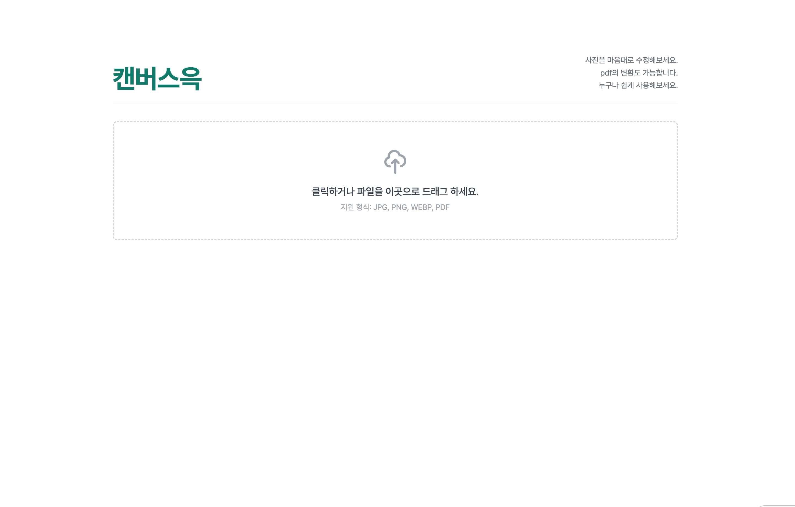

## 앱 이름: [캔버스윽]
## 카테고리: [유틸리티 앱]

### 배포 링크
[캔버스윽 링크](https://gemini.google.com/share/2ef6b644f06b)

### 데모 영상

### 이 앱을 만든 이유
흔히 사진 편집을 해야할 일이 종종 생기지만(용량 감소, 사진 크기, 화질 등), 사진 편집 앱을 받거나 프로그램을 설치해야 하는 번거로움이 존재합니다. 또한, 사진을 pdf로 변환하거나, pdf를 사진으로 변환해야 하는 경우들이 종종 있는데, 이 경우에 번거로움이 존재했습니다.

따라서 사진의 편집을 웹 상에서 간편하게 할 수 있도록 하여, 사진 편집 프로그램을 다뤄야하는 불편함을 해소하고자 하였습니다.

### 주요 기능
- 사진의 화질을 변경 (감소 및 증가)
- 사진의 비율 조정 (1:1, 4:3 등)
- 사진을 확장할 때 여백이 되는 배경 색상 추가
- 사진을 드래그해서 크기 조절
- 사진 선명도 조절
- 사진 회전 기능
- 확장자 변경 기능 (jpg, png, WebP, pdf)
   

# 프롬프트
## 초기 프롬프트
유틸리티 앱을 만들거고, 너는 이제부터 유틸리티 앱을 개발해주는 프로덕트 메이커고, 내가 요청하는 바를 모두 이해한 뒤 정보들을 기반으로 애플리케이션을 완성해주면 돼. 프롬프트를 점진적으로 개선해나가며, 완성할거고 이를 기반으로 한다는 점을 염두해둬.

[개요]
사진을 편집(크기 조절, 사이즈 조절, 회전, 용량 조절)하는 것을 어려워하는 사용자들을 위해 사진을 업로드 한 뒤(드래그 & 파일 선택) 이를 기반으로 사진의 용량을 줄이거나, 사이즈를 줄이거나 늘리기, 확장자를 변경하기 등의 기능을 수행하는 애플리케이션을 구현한다. 세부사항은 아래를 따른다.

[목표 사용자]

- 우아한테크코스 크루
- 사진 편집이 필요한 10~50대 사용자
- 컴퓨터를 잘 다루지 못하는 40~50대 사용자

[핵심 기능]

- 사진을 올리면 용량을 파악하고 용량을 줄여주는 기능
- 사진의 크기를 줄이거나 늘리거나 하는 크기 조절의 기능
- 사진을 미세하게 회전하는 기능
- 사진의 확장자를 변경할 수 있는 기능 (ex_ jpg, png)
- pdf를 올리면 이를 사진으로 변경해주는 기능 (pdf 2 others)

[구현 및 제한 조건]

- HTML, CSS, JavaScript 만을 사용하여 구현한다. 이 외의 기술은 사용하지 않는다.
- 디자인은 최대한 심플하게 하되 초록색을 사용한다. (포인트 색이 초록이며 그 외의 색상은 무채색을 사용한다. 강조 및 다른 색상표현이 필요한 경우에만 다른 색상을 사용한다.)
- 스타일은 노션과 유사한 형식이어야 한다.
- 누구나 직관적으로 클릭 앤 드래그의 형식으로 처리가 가능해야한다.

[성공 조건]
- 사진 용량 조절이 가능하다.
- 사진의 크기 조절이 가능하다.
- 사진의 확장자 변경이 가능하다.

## 추가 프롬프트
### 1.

여기서 사진의 크기는 드래그를 통해서 조절이 가능하다면 좋을 것 같아. 이미지를 보여주는 공간에서 드래그를 통해 사진의 크기가 변경되어야해. 그리고 사진의 크기 조절(픽셀)부분에 더해서 추가적으로 예를 들어서 인스타용 사진 사이즈 맞추기, 1:1, 4:3 등 다양한 비율로 선택을 해서 만들 수 있었으면 좋겠어. 

### 2.

사진의 크기를 조절하기 위해서 화면을 드래그할 때 사진의 크기가 실시간으로 줄어들거나 하지가 않아. 그것을 맞춰서 다시 해줄래?? 실시간으로 내가 드래그하는 만큼 크기가 조절되어져야해.

### 3.

비율선택은 드롭다운 메뉴가 아닌, 그냥 따로 모달을 띄워서 그 모달 내에서 선택이 가능하게끔 하면 UI측면에서 더 깔끔할 것 같아.

### 4.

근데 현재 프리셋을 선택하는 경우 비율에 맞춰서 이미지가 잘리거든?? 근데 그 잘리는 것 대신 화면의 배경색을 추출해내서 그걸로 사진을 연장시켜서 안 잘리도록 해주면 안 될까???

### 5.

다음으로는 "이미지 유틸리티" 라고 써있는데 이것을 서비스명으로 바꿔보자. 내 생각에는 위트있게 "캔버스윽"으로 하고싶어.

그리고 그 아래에는 "사진을 마음대로 수정해보세요."

그리고 줄바꾼 뒤 "pdf의 변환도 가능합니다."

그리고 줄 바꾼 뒤 "누구나 쉽게 사용해보세요."

이렇게 부제를 붙이면 어떨까 좋을 거 같은데

### 6.

이제 파일의 해상도를 보정해주는 기능도 추가가 되었으면 해. 이것도 추가해보는 거 어떨까. 사진의 선명도를 높여주는거야.

### 7.

용량이랑 선명도가 실시간으로 사진에 반영되지 않는 것 같아. 사람이 수치를 조절할 때마다 실시간으로 반영되도록 수정해줘.

### 8.

현재의 캔버스윽 애플리케이션에서
"사진을 마음대로 수정해보세요.
pdf의 변환도 가능합니다.
누구나 쉽게 사용해보세요."

이 문구가 나오는 부분을 캔버스윽 오른쪽에 넣었으면 해. 그니까 이게 부연 설명이니까 오른쪽에 배치시켜서 깔끔하게 디자인을 수정해볼까

### 9.

현재 가로 세로 비율을 유지하지 않고 늘릴 때 배경색상을 자동으로 추출해서 하잖아. 기본은 자동으로 추출해서 배경 색상을 늘리되, 배경 색상을 따로 직접 선택할 수 있었으면 좋겠어. 따로 우측에서 사진을 늘릴 때의 배경을 무슨 색으로 설정할지 선택할 수 있는 버튼이 존재하고 이를 누르면 팔레트가 떠서 거기에서 선택할 수 있었으면 좋겠어. 또한, 색상 코드를 입력하는 것도 포함되어지면 더 UX측면에서 좋을 것 같아.

### 10.

현재 가로 세로 비율을 유지하지 않고 늘릴 때 배경색상을 자동으로 추출해서 하잖아. 기본은 자동으로 추출해서 배경 색상을 늘리되, 배경 색상을 따로 직접 선택할 수 있었으면 좋겠어. 따로 우측에서 사진을 늘릴 때의 배경을 무슨 색으로 설정할지 선택할 수 있는 버튼이 존재하고 이를 누르면 팔레트가 떠서 거기에서 선택할 수 있었으면 좋겠어. 또한, 색상 코드를 입력하는 것도 포함되어지면 더 UX측면에서 좋을 것 같아.